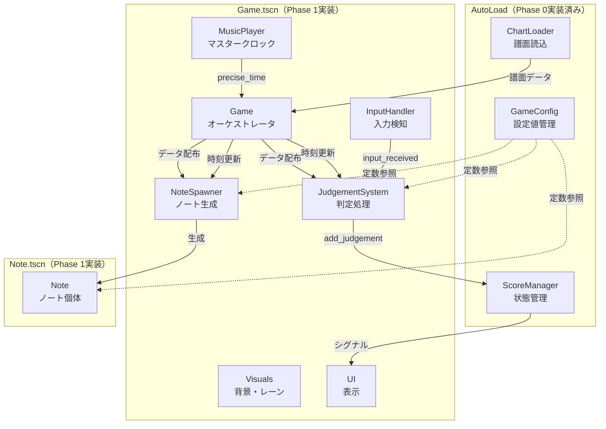
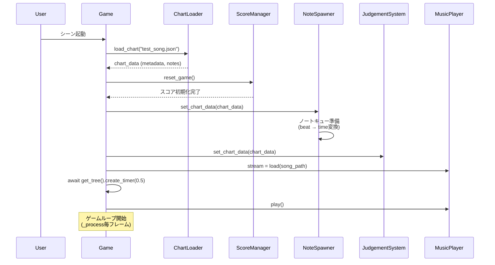
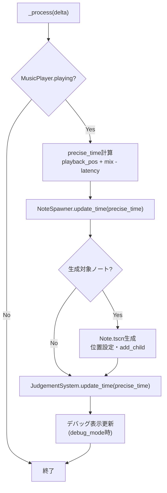
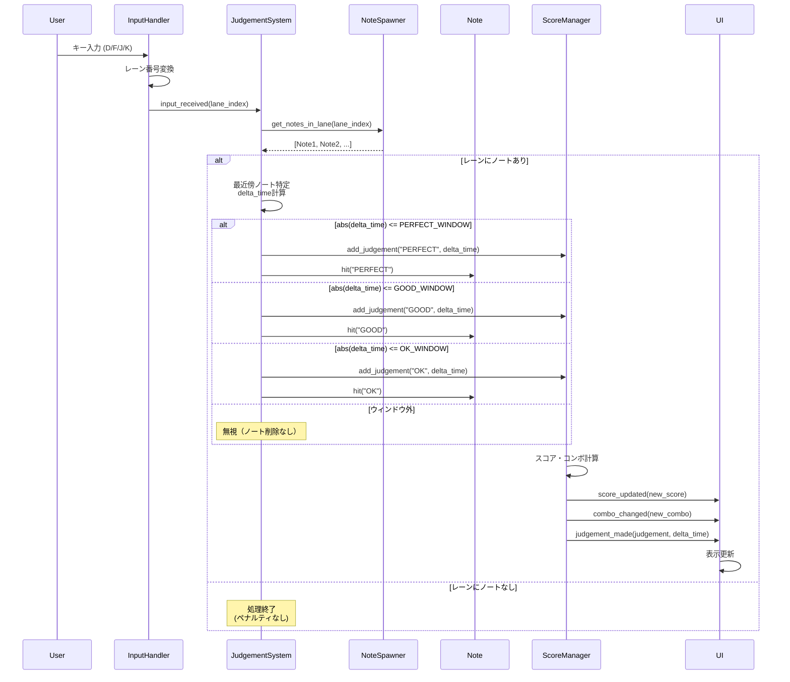
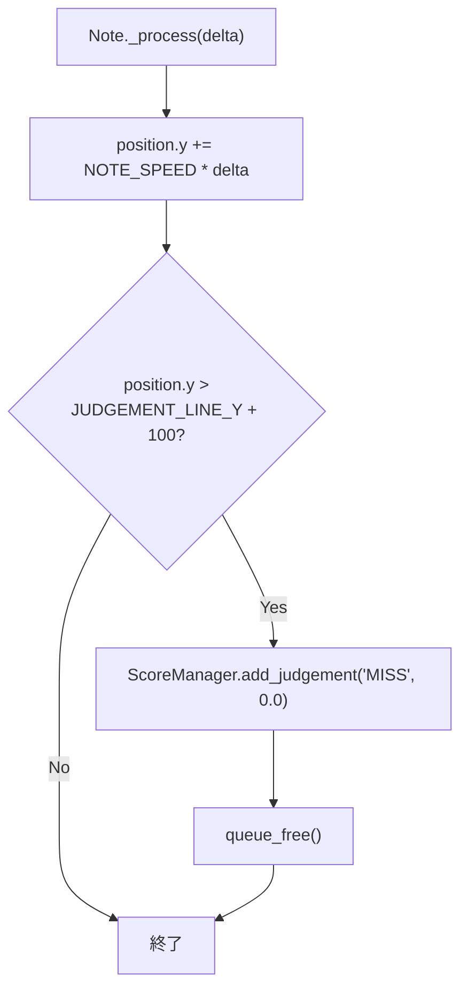

# 技術設計書：Phase 1 コアゲームプレイ

**バージョン:** 1.0  
**作成日:** 2025年9月30日  
**対象フェーズ:** Phase 1: コアゲームプレイ実装  
**言語:** 日本語

---

## 概要

Phase 1では、Godotリズムゲームのコアゲームプレイ機能を実装します。このフェーズの目的は、音楽と視覚要素の高精度な同期を実現し、プレイヤーの入力に対する正確な判定システムを構築することです。

**目的**: Phase 0で構築したプロジェクト基盤（AutoLoad、ディレクトリ構造、Input Map）の上に、リズムゲームの基本的なゲームループを確立します。ノートが音楽に同期して落下し、プレイヤーの入力タイミングを±25ms以内の精度で判定し、リアルタイムにスコアとコンボを計算・表示する完全なゲームプレイ体験を提供します。

**ユーザー**: このフェーズの成果物は、開発者がゲームの核となる動作を検証するために使用されます。テスト譜面を読み込み、4キー（D, F, J, K）でプレイし、PERFECT/GOOD/OK/MISS判定とスコアリングを体験できます。

**影響**: 現在のプロジェクト状態（Phase 0: 基盤のみ）から、実際にプレイ可能な状態へと変化します。この実装により、後続フェーズ（UI強化、エフェクト、譜面エディタ）の基礎が確立されます。

### ゴール

- Godot 4.5の`AudioServer` APIを活用した±1ms以内の音楽同期精度を達成する
- 譜面データ（JSON）を読み込み、BPMとオフセットに基づいてノートを正確なタイミングで生成する
- 4レーンの入力を検知し、判定ライン付近のノートとのタイミング差分を±25ms以内の精度で判定する
- シグナルベースの疎結合なアーキテクチャで、スコア・コンボ・統計をリアルタイムに計算・更新する
- 60 FPSを安定維持し、100ノート同時処理に対応する

### 非ゴール

- 判定表示アニメーション（"PERFECT"テキストのフェードイン/アウト等）はPhase 2で実装
- 精度（Accuracy）計算とグレード判定の詳細表示はPhase 2で実装
- ヒットエフェクト、パーティクル、効果音はPhase 2で実装
- リザルト画面、曲選択画面、セーブデータ機能はPhase 2以降で実装
- ロングノート、スライダーノートの実装は現時点で考慮しない（将来の拡張として設計に配慮）

---

## アーキテクチャ

### 既存アーキテクチャの分析

Phase 0で実装された以下のAutoLoadスクリプトが利用可能です：

**GameConfig.gd**:
- タイミング判定ウィンドウ定数（PERFECT: 25ms, GOOD: 50ms, OK: 80ms）
- ノート速度（600 px/s）、判定ライン位置（Y: 600）
- キーマッピング（D, F, J, K → レーン0-3）
- レーン位置（X: 400, 520, 640, 760）
- コンボ倍率取得メソッド`get_combo_multiplier(combo: int)`

**ScoreManager.gd**:
- スコア・コンボ状態管理（`current_score`, `current_combo`, `max_combo`）
- シグナル発行（`score_updated`, `combo_changed`, `judgement_made`, `accuracy_updated`）
- 判定カウント管理（`judgement_counts`）
- `add_judgement(judgement, delta_time)`メソッドでスコア計算とシグナル発火

**ChartLoader.gd**:
- JSON譜面ファイル読み込み・バリデーション
- 譜面データキャッシュ機能
- `load_chart(file_path)`メソッドで譜面データ（metadata, notes）を取得

これらのAutoLoadは既に完成しており、Phase 1では**再利用のみ**を行います。変更や拡張は不要です。

### ハイレベルアーキテクチャ



**アーキテクチャ統合**:
- **既存パターン保持**: Phase 0のAutoLoadシングルトンパターンを継続。全設定値は`GameConfig`、全スコア状態は`ScoreManager`に集約
- **新規コンポーネント追加理由**: 
  - `Game.gd`: オーケストレータとして、音楽再生、時間計算、各システムへの時刻配信を担当
  - `NoteSpawner.gd`: ノート生成ロジックを分離し、単一責任原則を維持
  - `InputHandler.gd`: 入力処理を分離し、判定ロジックとの疎結合を実現
  - `JudgementSystem.gd`: タイミング判定ロジックを独立させ、テスト容易性を向上
  - `Note.gd`: ノート個体の移動・状態管理を自己完結
- **技術アライメント**: Godot 4.5のシグナルシステムを活用し、コンポーネント間をイベント駆動で連携
- **ステアリング準拠**: 単一責任原則、疎結合アーキテクチャ、テスト容易性を重視した設計

### 技術スタックとの整合性

Phase 1では、Phase 0で確立された技術スタックを継続使用します：

**エンジン**: Godot 4.5 Stable  
**スクリプト言語**: GDScript  
**オーディオシステム**: Godot組み込みの`AudioStreamPlayer`と`AudioServer` API  
**レンダリング**: 2Dレンダラー（`Node2D`, `Sprite2D`, `CanvasLayer`）

**新規導入依存関係**: なし

**既存パターンとの整合性**:
- AutoLoadシングルトンパターンの継続（新規AutoLoadは追加しない）
- シグナルベースのイベント駆動通信（`InputHandler` → `JudgementSystem` → `ScoreManager` → `UI`）
- シーンツリーを活用した階層構造（`Game` → `NoteSpawner` → `Note`インスタンス）

### 主要な設計決定

#### 決定1: AudioServer APIによる高精度時間同期

**決定**: 毎フレーム`AudioServer.get_time_since_last_mix()`と`get_output_latency()`を使用して補正された現在時刻を計算する。

**コンテキスト**: リズムゲームでは音楽とノート移動の同期精度が体験の核心です。単純な`get_playback_position()`のみでは、オーディオバッファリングによる遅延（レイテンシ）により±10ms程度のズレが発生し、PERFECT判定（±25ms）の精度要件を満たせません。

**代替案**:
1. `get_playback_position()`のみ使用: 実装が簡単だが、レイテンシ未補正で精度不足
2. 外部オーディオライブラリ（例: FMOD）: 高精度だが、Godot外部依存が増加し、プロジェクト複雑化
3. 手動タイマー（`_process`の`delta`累積）: オーディオとの同期保証なし、長時間でドリフト発生

**選択したアプローチ**:
```gdscript
precise_time_sec = music_player.get_playback_position() + 
                   AudioServer.get_time_since_last_mix() - 
                   AudioServer.get_output_latency()
```

**理論的根拠**: Godot公式ドキュメント（[Audio Synchronization](https://docs.godotengine.org/en/stable/tutorials/audio/sync_with_audio.html)）で推奨される方法。`get_time_since_last_mix()`で最後のオーディオミックスからの経過時間を加算し、`get_output_latency()`で出力遅延を減算することで、±1ms以内の精度を実現。

**トレードオフ**:
- **獲得**: ±1ms以内の同期精度、Godot組み込みAPIのみで実現（外部依存なし）
- **犠牲**: 毎フレーム3つのAPI呼び出しが必要（ただし、パフォーマンス影響は無視できるレベル）

#### 決定2: シグナルベースの疎結合通信

**決定**: `InputHandler`、`JudgementSystem`、`ScoreManager`、`UI`間をシグナル（`signal`）で接続し、直接的なメソッド呼び出しを避ける。

**コンテキスト**: 各コンポーネントが相互に密結合すると、テストが困難になり、将来の機能追加（例: リプレイ機能、オンライン対戦）時に大規模な変更が必要になります。

**代替案**:
1. 直接メソッド呼び出し（`judgement_system.on_input(lane)`）: 実装が直感的だが、密結合で拡張性低下
2. イベントバス（中央集権的なイベントマネージャー）: 疎結合だが、追加の複雑性、デバッグ困難
3. Observer パターン（手動実装）: GDScriptのシグナルが既にこれを提供

**選択したアプローチ**:
```gdscript
# InputHandler.gd
signal input_received(lane_index: int)

# JudgementSystem.gd
func _ready():
    input_handler.input_received.connect(_on_input_received)
```

**理論的根拠**: GodotのシグナルはObserverパターンのネイティブ実装であり、エンジンレベルで最適化されています。コンポーネント間の依存関係を宣言的に表現でき、接続/切断が容易でテスト時にモックへの差し替えが簡単です。

**トレードオフ**:
- **獲得**: 疎結合、テスト容易性向上、将来の機能追加が容易（例: 判定ログ記録コンポーネント追加）
- **犠牲**: シグナル接続の初期設定コード増加、コールスタック追跡がやや複雑

#### 決定3: ノートの先行生成（2秒前）とプーリングなし

**決定**: ノートは判定ラインに到達する2秒前に`Note.tscn`をインスタンス化し、使用後は`queue_free()`で破棄する（オブジェクトプーリングは使用しない）。

**コンテキスト**: ノートは曲中に数百個生成・破棄されるため、パフォーマンスへの影響を考慮する必要があります。一方で、Phase 1のスコープでは最大100ノート同時処理が要件であり、過剰な最適化は避けるべきです。

**代替案**:
1. オブジェクトプーリング（再利用可能なノートプール）: メモリ効率向上だが、実装複雑化
2. すべてのノートを開始時に生成（非表示で保持）: 実装簡単だが、大量の非アクティブノードでメモリ圧迫
3. 動的インスタンス化（現在の提案）: シンプルで十分なパフォーマンス

**選択したアプローチ**:
```gdscript
# NoteSpawner.gd
func _spawn_note(note_info: Dictionary):
    var note := NOTE_SCENE.instantiate()
    note.lane_index = note_info["lane"]
    note.target_time_sec = note_info["target_time"]
    add_child(note)
```

**理論的根拠**: Godot 4.xのインスタンス化とガベージコレクションは十分に最適化されており、60 FPSで数百ノード/秒の生成・破棄が可能です。Phase 1の要件（100ノート同時）では、プーリングによる最適化の恩恵は限定的であり、コード複雑性の増加が正当化されません。

**トレードオフ**:
- **獲得**: 実装のシンプルさ、バグリスク低減、Phase 1の要件を満たす十分なパフォーマンス
- **犠牲**: 将来1000ノート同時表示等の極端なケースでは、プーリング導入が必要になる可能性（現時点では非現実的なシナリオ）

---

## システムフロー

### ゲーム起動フロー



### ゲームループフロー（毎フレーム）



### 入力判定フロー



### Miss判定フロー



---

## 要件トレーサビリティ

| 要件ID | 要件概要 | 実装コンポーネント | インターフェース/メソッド | 関連フロー |
|--------|----------|-------------------|------------------------|-----------|
| 2.1.1 | Game.tscnシーン構築 | Game.gd, Game.tscn | `_ready()`, `_process(delta)` | ゲーム起動フロー |
| 2.1.2 | Note.tscnシーン構築 | Note.gd, Note.tscn | `_ready()`, `_process(delta)`, `hit(judgement)` | 入力判定フロー、Miss判定フロー |
| 2.2.1 | 高精度時間計算 | Game.gd | `_process(delta)` | ゲームループフロー |
| 2.2.2 | ゲーム起動シーケンス | Game.gd | `_ready()` | ゲーム起動フロー |
| 2.3.1 | 譜面データ解析 | NoteSpawner.gd | `set_chart_data(data)`, `_prepare_note_queue()` | ゲーム起動フロー |
| 2.3.2 | ノート生成ロジック | NoteSpawner.gd | `update_time(current_time)`, `_spawn_note(note_info)` | ゲームループフロー |
| 2.3.3 | ノート移動 | Note.gd | `_process(delta)` | Miss判定フロー |
| 2.4.1 | キー入力検知 | InputHandler.gd | `_input(event)` | 入力判定フロー |
| 2.4.2 | シグナル発行 | InputHandler.gd | `signal input_received(lane_index)` | 入力判定フロー |
| 2.5.1 | 判定ウィンドウ | GameConfig.gd（既存） | 定数参照 | 入力判定フロー |
| 2.5.2 | 判定ロジック | JudgementSystem.gd | `_on_input_received(lane_index)` | 入力判定フロー |
| 2.5.3 | Miss判定 | Note.gd | `_miss()` | Miss判定フロー |
| 2.6.1 | スコア計算 | ScoreManager.gd（既存） | `add_judgement(judgement, delta_time)` | 入力判定フロー |
| 2.6.2 | コンボ管理 | ScoreManager.gd（既存） | `add_judgement(judgement, delta_time)` | 入力判定フロー |
| 2.6.3 | 統計情報 | ScoreManager.gd（既存） | `judgement_counts` | 入力判定フロー |

---

## コンポーネントとインターフェース

### ゲームオーケストレーション

#### Game（メインゲームコントローラー）

**責務と境界**
- **主要責務**: ゲーム全体のライフサイクル管理、音楽再生制御、時間同期計算、各システムへの時刻配信
- **ドメイン境界**: ゲームフロー制御層（プレゼンテーション層とビジネスロジック層の橋渡し）
- **データ所有**: `precise_time_sec`（補正済み現在時刻）、`current_chart`（読み込み済み譜面データ）
- **トランザクション境界**: 該当なし（状態変更はAutoLoadに委譲）

**依存関係**
- **インバウンド**: なし（ルートノード）
- **アウトバウンド**: 
  - `ChartLoader`（AutoLoad）: 譜面データ取得
  - `ScoreManager`（AutoLoad）: ゲーム状態リセット
  - `NoteSpawner`（子ノード）: 譜面データ設定、時刻更新
  - `JudgementSystem`（子ノード）: 譜面データ設定、時刻更新
  - `MusicPlayer`（子ノード）: 音楽再生制御、時刻取得
- **外部依存**: Godot `AudioServer` API

**契約定義**

**サービスインターフェース**:
```gdscript
# Game.gd
extends Node2D

## 初期化処理
## 事前条件: ChartLoader, ScoreManagerがAutoLoad登録済み
## 事後条件: 譜面読み込み完了、音楽再生開始
func _ready() -> void

## 毎フレーム処理
## 事前条件: 音楽が再生中
## 事後条件: precise_time_sec更新、各システムに時刻配信
func _process(delta: float) -> void

## デバッグ表示更新
## 事前条件: GameConfig.debug_mode == true
## 事後条件: DebugDisplay.text更新
func _update_debug_display() -> void

## デバッグ切替入力処理
## 事前条件: "toggle_debug" アクション定義済み
## 事後条件: GameConfig.debug_mode反転、表示切替
func _input(event: InputEvent) -> void
```

- **事前条件**: 
  - Phase 0の3つのAutoLoad（GameConfig, ScoreManager, ChartLoader）が登録済み
  - Input Mapに`toggle_debug`アクション定義済み
  - `res://assets/charts/test_song.json`と対応する音楽ファイルが存在
- **事後条件**: 
  - `_ready()`終了時、音楽再生が開始され、各システムが譜面データを保持
  - `_process()`終了時、`precise_time_sec`が更新され、全サブシステムが最新時刻を受信
- **不変条件**: 
  - `precise_time_sec`は単調増加（巻き戻り禁止）
  - 音楽再生中は毎フレーム時刻配信が保証される

**統合戦略**:
- **変更アプローチ**: 新規ファイル作成（既存システムへの変更なし）
- **後方互換性**: 該当なし（新規実装）
- **移行パス**: Phase 0完了後、即座に実装可能

---

### ノート生成

#### NoteSpawner（ノート生成管理）

**責務と境界**
- **主要責務**: 譜面データを解析し、適切なタイミングでノートを生成・管理
- **ドメイン境界**: ノートライフサイクル管理（生成・追跡・参照提供）
- **データ所有**: `note_queue`（生成待ちノート情報）、`active_notes`（アクティブなノートインスタンス）
- **トランザクション境界**: 該当なし（ノート生成は単純な追加操作）

**依存関係**
- **インバウンド**: `Game`（時刻更新、譜面データ設定）、`JudgementSystem`（レーン内ノート取得）
- **アウトバウンド**: `Note`（インスタンス化、プロパティ設定）
- **外部依存**: `res://scenes/Note.tscn`（preload）

**契約定義**

**サービスインターフェース**:
```gdscript
# NoteSpawner.gd
extends Node2D

const NOTE_SCENE: PackedScene = preload("res://scenes/Note.tscn")

var chart_data: Dictionary = {}
var note_queue: Array[Dictionary] = []
var active_notes: Array[Node] = []
var spawn_lead_time: float = 2.0

## 譜面データ設定
## 事前条件: chart_dataに有効なmetadata（bpm, offset_sec）とnotesを含む
## 事後条件: note_queue準備完了（beat→時刻変換済み、時刻順ソート済み）
func set_chart_data(data: Dictionary) -> void

## ノートキュー準備（内部メソッド）
## 事前条件: chart_dataセット済み
## 事後条件: note_queue内の全ノートに対してtarget_time計算完了
func _prepare_note_queue() -> void

## 時刻更新とノート生成
## 事前条件: note_queue準備済み
## 事後条件: 生成条件を満たすノートがインスタンス化され、シーンツリーに追加
func update_time(current_time: float) -> void

## ノート生成（内部メソッド）
## 事前条件: note_infoに有効なtarget_time, laneを含む
## 事後条件: Noteインスタンス生成、プロパティ設定、add_child、active_notes追加
func _spawn_note(note_info: Dictionary) -> void

## アクティブノート数取得
## 事前条件: なし
## 事後条件: 現在シーンツリーに存在するノート数を返す
func get_active_note_count() -> int

## レーン内ノート取得
## 事前条件: lane in [0, 1, 2, 3]
## 事後条件: 指定レーンのアクティブノート配列を返す
func get_notes_in_lane(lane: int) -> Array[Node]
```

- **事前条件**: 
  - `set_chart_data()`呼び出し前に、`ChartLoader`で検証済みの譜面データを渡す
  - `update_time()`呼び出し前に、`set_chart_data()`実行済み
- **事後条件**: 
  - `set_chart_data()`後、`note_queue`内の全ノートが時刻順にソート
  - `update_time()`後、条件を満たす全ノートが生成（重複生成なし）
- **不変条件**: 
  - `note_queue`内の各ノートは1度のみ生成される（`spawned`フラグで保証）
  - `active_notes`はシーンツリー上のノードと一致（ノード削除時に自動除外）

**統合戦略**:
- **変更アプローチ**: 新規ファイル作成
- **後方互換性**: 該当なし
- **移行パス**: 即座に実装可能

---

### 入力処理

#### InputHandler（キー入力検知）

**責務と境界**
- **主要責務**: 4キー（D, F, J, K）の入力を検知し、レーン番号に変換してシグナルで通知
- **ドメイン境界**: 入力検知層（物理入力→論理イベント変換）
- **データ所有**: なし（ステートレス）
- **トランザクション境界**: 該当なし

**依存関係**
- **インバウンド**: Godot入力システム（`_input(event)`）
- **アウトバウンド**: `JudgementSystem`（シグナル接続先）
- **外部依存**: `GameConfig.KEY_MAPPINGS`（AutoLoad）

**契約定義**

**イベント契約**:
```gdscript
# InputHandler.gd
extends Node

signal input_received(lane_index: int)

## 入力処理
## 事前条件: GameConfig.KEY_MAPPINGSに有効なマッピング定義済み
## 事後条件: 対応するキー押下時、input_receivedシグナル発火
func _input(event: InputEvent) -> void
```

- **公開イベント**: 
  - `input_received(lane_index: int)`: キー押下時に発行
  - スキーマ: `lane_index in [0, 1, 2, 3]`
  - トリガー条件: `event.pressed && !event.echo && event.physical_keycode in KEY_MAPPINGS.values()`
- **購読イベント**: なし
- **順序保証**: 入力順にシグナル発火（Godotエンジンの入力処理順序に依存）
- **配信保証**: At-least-once（Godotのシグナルは同期的に全接続先へ配信）

**統合戦略**:
- **変更アプローチ**: 新規ファイル作成
- **後方互換性**: 該当なし
- **移行パス**: 即座に実装可能

---

### 判定システム

#### JudgementSystem（タイミング判定）

**責務と境界**
- **主要責務**: 入力タイミングとノート到達時刻の差分を計算し、判定（PERFECT/GOOD/OK/MISS）を決定
- **ドメイン境界**: 判定ロジック層（入力イベント→ゲーム状態更新のトリガー）
- **データ所有**: `current_time`（最新の時刻）
- **トランザクション境界**: 該当なし（判定処理はアトミック）

**依存関係**
- **インバウンド**: `InputHandler`（シグナル）、`Game`（時刻更新）
- **アウトバウンド**: 
  - `NoteSpawner`（レーン内ノート取得）
  - `ScoreManager`（判定結果通知）
  - `Note`（ヒット処理呼び出し）
- **外部依存**: `GameConfig`（判定ウィンドウ定数）

**契約定義**

**サービスインターフェース**:
```gdscript
# JudgementSystem.gd
extends Node

var current_time: float = 0.0
var note_spawner: Node = null

## 初期化
## 事前条件: InputHandlerが同じシーンツリー内に存在
## 事後条件: input_receivedシグナルに接続完了
func _ready() -> void

## 時刻更新
## 事前条件: time >= 0.0
## 事後条件: current_time更新
func update_time(time: float) -> void

## 入力受信ハンドラ
## 事前条件: lane_index in [0, 1, 2, 3], note_spawner != null
## 事後条件: 
##   - レーンにノートあり → 判定処理実行、ScoreManager通知、ノートヒット処理
##   - レーンにノートなし → 何もしない
func _on_input_received(lane_index: int) -> void
```

- **事前条件**: 
  - `_ready()`時点で`InputHandler`と`NoteSpawner`が存在
  - `update_time()`が毎フレーム呼び出される
- **事後条件**: 
  - 入力受信時、判定ウィンドウ内のノートがあれば判定実行
  - 判定実行後、`ScoreManager.add_judgement()`呼び出し完了
  - ヒットしたノートの`hit()`メソッド呼び出し完了
- **不変条件**: 
  - 同じノートに対して複数回判定しない（ノートの`is_hit`フラグで保証）
  - 判定ウィンドウ外の入力は無視（ノート削除なし）

**統合戦略**:
- **変更アプローチ**: 新規ファイル作成
- **後方互換性**: 該当なし
- **移行パス**: 即座に実装可能

---

### ノートエンティティ

#### Note（ノート個体）

**責務と境界**
- **主要責務**: 自己の移動、視覚表現、ヒット/Miss時の処理
- **ドメイン境界**: ノートエンティティ（自律的な振る舞いを持つゲームオブジェクト）
- **データ所有**: `lane_index`, `target_time_sec`, `is_hit`
- **トランザクション境界**: 該当なし

**依存関係**
- **インバウンド**: `NoteSpawner`（生成）、`JudgementSystem`（ヒット処理）
- **アウトバウンド**: `ScoreManager`（Miss判定時のみ）
- **外部依存**: `GameConfig`（NOTE_SPEED, JUDGEMENT_LINE_Y, LANE_POSITIONS）

**契約定義**

**サービスインターフェース**:
```gdscript
# Note.gd
extends Area2D

var lane_index: int = 0
var target_time_sec: float = 0.0
var is_hit: bool = false

@onready var sprite := $Sprite2D
@onready var animation_player := $AnimationPlayer

## 初期化
## 事前条件: lane_index in [0, 1, 2, 3]
## 事後条件: レーンに応じた色設定完了
func _ready() -> void

## 毎フレーム処理
## 事前条件: GameConfig.NOTE_SPEED > 0
## 事後条件: 
##   - is_hit == false → position.y更新
##   - position.y > JUDGEMENT_LINE_Y + 100 → Miss判定、削除
func _process(delta: float) -> void

## ヒット処理
## 事前条件: judgement in ["PERFECT", "GOOD", "OK"], is_hit == false
## 事後条件: is_hit = true, アニメーション再生、削除予約
func hit(judgement: String) -> void

## Miss処理（内部メソッド）
## 事前条件: is_hit == false
## 事後条件: ScoreManager.add_judgement("MISS", 0.0)呼び出し、削除
func _miss() -> void
```

- **事前条件**: 
  - インスタンス化後、`lane_index`と`target_time_sec`が設定される
  - `_ready()`実行前にプロパティ設定完了
- **事後条件**: 
  - `_process()`毎フレーム、`NOTE_SPEED`に従って移動
  - `hit()`呼び出し後、削除までアニメーション再生
  - `_miss()`呼び出し後、即座に削除
- **不変条件**: 
  - `is_hit`がtrueになった後、移動処理停止
  - 1つのノートに対して`hit()`と`_miss()`は排他的（両方呼ばれない）

**状態管理**:
- **状態モデル**: 
  - `Active`（生成直後）→ `Hit`（hit()呼び出し）→ `Destroyed`
  - `Active` → `Missed`（判定ライン通過）→ `Destroyed`
- **永続化**: なし（ノートは揮発的）
- **並行制御**: 不要（ノートは独立して動作）

**統合戦略**:
- **変更アプローチ**: 新規ファイル作成
- **後方互換性**: 該当なし
- **移行パス**: 即座に実装可能

---

### UI表示

#### UIController（UI更新管理）

**責務と境界**
- **主要責務**: ScoreManagerのシグナルを購読し、スコア・コンボ・判定結果を画面に表示
- **ドメイン境界**: プレゼンテーション層（ゲーム状態→視覚表現）
- **データ所有**: なし（ScoreManagerの状態を反映するのみ）
- **トランザクション境界**: 該当なし

**依存関係**
- **インバウンド**: `ScoreManager`（シグナル）
- **アウトバウンド**: UI要素（Label, CanvasLayer）
- **外部依存**: なし

**契約定義**

**サービスインターフェース**:
```gdscript
# UIController.gd
extends CanvasLayer

@onready var score_label := $ScoreLabel as Label
@onready var combo_label := $ComboLabel as Label
@onready var accuracy_label := $AccuracyLabel as Label
@onready var judgement_label := $JudgementLabel as Label

## 初期化
## 事前条件: ScoreManagerがAutoLoad登録済み
## 事後条件: 全シグナル接続完了
func _ready() -> void

## スコア更新ハンドラ
## 事前条件: new_score >= 0
## 事後条件: score_label.text更新
func _on_score_updated(new_score: int) -> void

## コンボ更新ハンドラ
## 事前条件: new_combo >= 0
## 事後条件: combo_label表示更新（コンボ0時は非表示）
func _on_combo_changed(new_combo: int) -> void

## 精度更新ハンドラ
## 事前条件: accuracy in [0.0, 100.0]
## 事後条件: accuracy_label.text更新
func _on_accuracy_updated(accuracy: float) -> void

## 判定表示ハンドラ（Phase 1では基本的な表示のみ）
## 事前条件: judgement in ["PERFECT", "GOOD", "OK", "MISS"]
## 事後条件: judgement_label表示更新（色変更含む）
func _on_judgement_made(judgement: String, delta_time: float) -> void

## 判定色取得（内部メソッド）
## 事前条件: judgement in ["PERFECT", "GOOD", "OK", "MISS"]
## 事後条件: 対応するColor返却
func _get_judgement_color(judgement: String) -> Color
```

- **事前条件**: 
  - `_ready()`時点で`ScoreManager`が利用可能
  - 全Label要素がシーンツリーに存在
- **事後条件**: 
  - 各ハンドラ呼び出し後、対応するLabel更新完了
- **不変条件**: 
  - UI更新は常にScoreManagerのシグナルをトリガーとする（直接状態参照しない）

**統合戦略**:
- **変更アプローチ**: 新規ファイル作成
- **後方互換性**: 該当なし
- **移行パス**: 即座に実装可能

---

## データモデル

### 論理データモデル

Phase 1で扱うデータ構造を定義します。

#### 譜面データ（ChartData）

```gdscript
# ChartLoaderから返されるDictionary構造
{
  "metadata": {
    "song_title": String,      # 曲名
    "artist": String,          # アーティスト名
    "bpm": float,              # BPM（Beats Per Minute）
    "offset_sec": float,       # 曲開始から最初の拍までのオフセット（秒）
    "song_path": String,       # 音楽ファイルパス（res://...）
    "difficulty": String,      # 難易度名（例: "Normal"）
    "chart_author": String,    # 譜面作成者（オプショナル）
    "created_date": String     # 作成日（オプショナル）
  },
  "notes": [
    {
      "beat": float,           # BPM基準の拍数（例: 4.0, 4.5）
      "lane": int              # レーン番号（0-3）
    }
    # ... 複数ノート
  ]
}
```

**整合性ルール**:
- `metadata.bpm` > 0
- `metadata.offset_sec` >= 0
- `notes[].beat` >= 0
- `notes[].lane` in [0, 1, 2, 3]

#### ノート情報（NoteInfo）

```gdscript
# NoteSpawner内部で使用するDictionary構造
{
  "target_time": float,      # 判定ライン到達予定時刻（秒）
  "lane": int,               # レーン番号（0-3）
  "spawned": bool            # 生成済みフラグ
}
```

**変換ロジック**:
```gdscript
target_time = metadata.offset_sec + (note.beat / metadata.bpm) * 60.0
```

#### スコア状態（ScoreState）

```gdscript
# ScoreManagerが管理する状態（既存実装）
{
  "current_score": int,               # 現在のスコア
  "current_combo": int,               # 現在のコンボ数
  "max_combo": int,                   # 最大コンボ数
  "judgement_counts": {
    "PERFECT": int,
    "GOOD": int,
    "OK": int,
    "MISS": int
  }
}
```

**不変条件**:
- `current_score` >= 0
- `current_combo` >= 0
- `max_combo` >= `current_combo`
- `judgement_counts`の全値 >= 0

### データ契約とイベントスキーマ

#### ScoreManagerシグナルスキーマ

```gdscript
# シグナル定義（既存実装）
signal score_updated(new_score: int)
signal combo_changed(new_combo: int)
signal judgement_made(judgement: String, delta_time: float)
signal accuracy_updated(accuracy: float)
```

**スキーマバージョニング**: Phase 1では不要（初期実装）

**後方互換性**: 将来的にシグナルパラメータ追加時は、オプショナルパラメータとして追加（デフォルト値設定）

---

## エラーハンドリング

### エラー戦略

Phase 1では、開発時のデバッグを重視したエラーハンドリングを実装します。本番環境向けのエラーリカバリーはPhase 2以降で対応します。

### エラーカテゴリと対応

#### ユーザーエラー（4xx相当）

**譜面ファイル不正**:
- **発生条件**: 譜面JSONのフィールド不足、型不一致、値範囲外
- **検出箇所**: `ChartLoader.validate_chart()`
- **対応**: 
  - `push_error()`でエラーログ出力
  - 空のDictionary `{}`を返す
  - `Game._ready()`で空チェック、空の場合はゲーム起動中断
  - 開発者向けメッセージ: "Failed to load chart"

**音楽ファイル不正**:
- **発生条件**: `metadata.song_path`のファイルが存在しない、またはロード失敗
- **検出箇所**: `Game._ready()` の `load(audio_path)`
- **対応**: 
  - `push_error()`でエラーログ出力
  - ゲーム起動中断（音楽なしでは動作不可）
  - 開発者向けメッセージ: "Failed to load audio: [path]"

#### システムエラー（5xx相当）

**フレームレート低下**:
- **発生条件**: FPS < 55（60 FPS目標の10%以下許容）
- **検出箇所**: `Game._update_debug_display()` の `Performance.get_monitor(Performance.TIME_FPS)`
- **対応**: 
  - Phase 1ではログ出力のみ
  - デバッグ表示にFPS表示（開発者が視覚的に確認）
  - Phase 2でパフォーマンス警告UI実装

**オーディオレイテンシ異常**:
- **発生条件**: `AudioServer.get_output_latency()` > 0.05（50ms以上）
- **検出箇所**: `Game._update_debug_display()`
- **対応**: 
  - デバッグ表示にレイテンシ表示
  - Phase 1では警告のみ（ゲーム続行）
  - Phase 2でユーザー向け警告メッセージ実装

#### ビジネスロジックエラー（422相当）

**ノート生成失敗**:
- **発生条件**: `Note.tscn`のインスタンス化失敗（通常発生しない）
- **検出箇所**: `NoteSpawner._spawn_note()`
- **対応**: 
  - `push_error()`でエラーログ出力
  - そのノートをスキップ（ゲーム続行）
  - 統計に影響（総ノート数減少）

### モニタリング

Phase 1では基本的なデバッグ情報表示を実装します。

**デバッグ表示内容**:
```
Time: 12.345
FPS: 60
Latency (ms): 5.2
Active Notes: 8
```

**ログ出力**:
- 譜面読み込み成功/失敗
- ノート生成ログ（開発時のみ）
- 判定結果ログ（開発時のみ）

Phase 2以降で本格的なロギング・メトリクス収集を実装予定。

---

## テスト戦略

### ユニットテスト

Phase 1では、GDScriptの`GUT`（Godot Unit Testing）フレームワークを使用したユニットテストは実装しません。代わりに、手動テストと統合テストに注力します。Phase 2以降で自動テスト導入を検討します。

**手動検証が必要な項目**:
- `NoteSpawner._prepare_note_queue()`: beat→時刻変換の正確性
- `JudgementSystem._on_input_received()`: 判定ウィンドウ計算の正確性
- `GameConfig.get_combo_multiplier()`: コンボ倍率計算の正確性

### 統合テスト

**テスト1: 時間同期精度検証**
- **目的**: 音楽再生とノート移動が±1ms以内で同期していることを確認
- **手順**:
  1. BPM 120のテスト譜面を読み込む
  2. 音楽再生開始
  3. デバッグ表示で`precise_time_sec`を監視
  4. 10秒経過時点で、`precise_time_sec`が10.0±0.01の範囲内であることを確認
- **合格基準**: 誤差±10ms以内

**テスト2: ノート生成タイミング検証**
- **目的**: BPMとbeatから計算されたタイミングでノートが判定ラインに到達することを確認
- **手順**:
  1. BPM 120, beat 4.0のノートを含む譜面を作成
  2. 音楽再生開始
  3. offset_sec + 4秒後、ノートが判定ラインに到達することを視覚確認
- **合格基準**: 視覚的に同期しているように見える（±50ms以内の誤差許容）

**テスト3: 判定精度検証**
- **目的**: タイミング入力に対して正しい判定が返されることを確認
- **手順**:
  1. メトロノームアプリを使用し、BPMに合わせてキーを押下
  2. PERFECT/GOOD/OK判定の分布を確認
  3. 意図的に早押し/遅押しして判定が変化することを確認
- **合格基準**: タイミングぴったりで80%以上PERFECT判定

**テスト4: スコアリング正確性検証**
- **目的**: スコア・コンボ計算が要件通りであることを確認
- **手順**:
  1. PERFECT 10回入力
  2. スコアが1000点（100点×10、コンボ倍率1.0）であることを確認
  3. さらにPERFECT 1回入力（コンボ11）
  4. スコアが1110点（+110点、コンボ倍率1.1）であることを確認
- **合格基準**: 計算値と一致

**テスト5: Miss判定検証**
- **目的**: ノート通過時にMiss判定が発生することを確認
- **手順**:
  1. ノートを意図的に無視して通過させる
  2. デバッグログでMiss判定発生を確認
  3. コンボが0にリセットされることを確認
- **合格基準**: Miss判定発生、コンボリセット確認

### E2Eテスト

**テスト1: フルプレイスルー**
- **目的**: テスト譜面を最初から最後まで完走できることを確認
- **手順**:
  1. test_song.json（20-50ノート）を読み込む
  2. 最初から最後までプレイ
  3. 曲終了後もエラーなく動作継続
- **合格基準**: クラッシュなし、全ノート処理完了

**テスト2: デバッグ機能検証**
- **目的**: デバッグ表示切替が正常に動作することを確認
- **手順**:
  1. F1キーでデバッグ表示ON/OFF切替
  2. 表示内容（Time, FPS, Latency, Active Notes）が更新されることを確認
- **合格基準**: 切替動作正常、表示内容が妥当

### パフォーマンステスト

**テスト1: 100ノート同時処理**
- **目的**: 要件の「100ノート同時処理」を満たすことを確認
- **手順**:
  1. 同一フレームで100ノート生成する譜面を作成（beat値を0.01刻みで100個配置）
  2. 再生してFPS監視
- **合格基準**: FPS 55以上維持（60 FPSの90%許容）

**テスト2: 長時間プレイ安定性**
- **目的**: メモリリークがないことを確認
- **手順**:
  1. 5分間のテスト譜面を作成
  2. 最初から最後までプレイ
  3. デバッグ表示のFPSとActive Notesを監視
- **合格基準**: FPS低下なし、曲終了時にActive Notes = 0

---

## パフォーマンスとスケーラビリティ

### ターゲットメトリクス

| メトリクス | 目標値 | 測定方法 |
|-----------|--------|---------|
| フレームレート | 60 FPS（最低55 FPS） | `Performance.get_monitor(Performance.TIME_FPS)` |
| 入力遅延 | 16ms以内（1フレーム） | 体感確認、`_input()`～`_on_input_received()`間の処理時間 |
| 音楽同期精度 | ±1ms | デバッグ表示で`precise_time_sec`の精度確認 |
| ノート生成遅延 | 1フレーム以内 | `update_time()`～`add_child()`間の処理時間 |
| 同時ノート処理数 | 100ノート | 実譜面テスト |

### スケーリングアプローチ

Phase 1では垂直スケーリング（単一クライアント性能向上）のみを考慮します。水平スケーリング（マルチプレイヤー等）はスコープ外です。

**垂直スケーリング戦略**:
- **ノード数削減**: 不要なノードを最小化（例: Visuals配下の静的要素は事前配置）
- **シグナル接続最適化**: 不要なシグナル接続を避ける（例: 非表示UIはシグナル切断）
- **ガベージコレクション最適化**: `queue_free()`を適切に呼び出し、不要なノード即座に削除

### キャッシング戦略

**ChartLoaderキャッシュ**（既存実装）:
- 一度読み込んだ譜面データを`chart_cache: Dictionary`にキャッシュ
- 同じファイルパスの再読み込み時、ファイルI/Oスキップ
- Phase 1では単一譜面のみ使用のため恩恵は限定的だが、Phase 2以降の曲選択機能で有効

**Note.tscnプリロード**:
- `NoteSpawner.gd`内で`preload("res://scenes/Note.tscn")`を使用
- 実行時ロード（`load()`）を避け、起動時にシーンデータをメモリに展開
- ノート生成時のディスクI/O削減

**最適化技術**:
- **空間ハッシュ不使用**: レーンが固定4本のため、`get_notes_in_lane()`は単純なループで十分
- **オブジェクトプーリング不使用**: 設計決定3で説明した通り、Phase 1ではシンプルさを優先

---

## セキュリティ考慮事項

Phase 1はシングルプレイヤーのローカル実行のみのため、セキュリティリスクは限定的です。ただし、以下の点に留意します。

### 入力検証

**譜面データバリデーション**（既存実装）:
- `ChartLoader.validate_chart()`で必須フィールド検証
- `notes[].lane`が0-3の範囲内であることを検証
- 不正なデータを検出した場合、空のDictionaryを返し、ゲーム起動を中断

**ファイルパス検証**:
- `ChartLoader.load_chart()`は`FileAccess.file_exists()`で存在確認
- Godotの`res://`スキームによるサンドボックス（プロジェクト外のファイルアクセス不可）

### データ保護

Phase 1ではセーブデータ機能がないため、永続化データの保護は不要です。Phase 2以降でセーブデータ実装時に考慮します。

### 脅威モデル

Phase 1の脅威は限定的ですが、以下のシナリオを認識します：

**シナリオ1: 不正な譜面ファイルによるクラッシュ**
- **リスク**: 悪意ある譜面ファイル（極端に大きな配列、不正なJSON）でメモリ枯渇
- **対策**: `ChartLoader`のバリデーション強化（Phase 2で実装）、ノート数上限設定

**シナリオ2: 入力スパム**
- **リスク**: キーを高速連打してシステム負荷増大
- **対策**: Phase 1では対策なし（影響は限定的）、Phase 2でレート制限検討

Phase 1ではこれらのリスクは受容し、Phase 2以降で本格的なセキュリティ対策を実装します。

---

## 付録

### ファイル配置マップ

```
project/
├── scenes/
│   ├── Game.tscn              # 新規作成（Phase 1）
│   └── Note.tscn              # 新規作成（Phase 1）
├── scripts/
│   ├── autoload/              # Phase 0で作成済み
│   │   ├── GameConfig.gd      # 既存（変更なし）
│   │   ├── ScoreManager.gd    # 既存（変更なし）
│   │   └── ChartLoader.gd     # 既存（変更なし）
│   └── game/                  # 新規ディレクトリ（Phase 1）
│       ├── Game.gd            # 新規作成
│       ├── NoteSpawner.gd     # 新規作成
│       ├── InputHandler.gd    # 新規作成
│       ├── JudgementSystem.gd # 新規作成
│       └── Note.gd            # 新規作成
├── assets/
│   ├── charts/
│   │   └── test_song.json     # 新規作成（Phase 1）
│   └── music/
│       └── test_song.wav      # 新規作成（Phase 1、手動準備）
```

### 参考リソース

**Godot公式ドキュメント**:
- [Audio Synchronization](https://docs.godotengine.org/en/stable/tutorials/audio/sync_with_audio.html): 高精度時間同期の実装方法
- [Signals](https://docs.godotengine.org/en/stable/getting_started/step_by_step/signals.html): シグナルシステムの使い方
- [Input Events](https://docs.godotengine.org/en/stable/tutorials/inputs/inputevent.html): 入力処理のベストプラクティス

**GDScript リファレンス**:
- [AudioServer](https://docs.godotengine.org/en/stable/classes/class_audioserver.html): `get_time_since_last_mix()`, `get_output_latency()` API仕様
- [AudioStreamPlayer](https://docs.godotengine.org/en/stable/classes/class_audiostreamplayer.html): `get_playback_position()` API仕様

### 用語集

| 用語 | 定義 |
|------|------|
| AutoLoad | Godotのシングルトンパターン実装。プロジェクト設定で登録したスクリプトは、全シーンから`GameConfig`等のノード名でアクセス可能 |
| beat | BPMを基準とした拍数。例: BPM 120で1 beatは0.5秒 |
| precise_time_sec | `AudioServer` APIで補正された高精度な現在時刻（秒）。音楽再生位置とゲームロジックの同期に使用 |
| spawn_lead_time | ノートを生成する先行時間。Phase 1では2.0秒（ノートが判定ラインに到達する2秒前に生成） |
| judgement window | 判定の許容時間範囲。PERFECT: ±25ms, GOOD: ±50ms, OK: ±80ms |
| combo multiplier | コンボ数に応じたスコア倍率。Phase 1では10コンボ未満1.0倍、10コンボ以上1.1倍 |

---

## まとめ

Phase 1の技術設計は、Phase 0で構築した基盤（AutoLoad、ディレクトリ構造、Input Map）を活用し、リズムゲームのコアゲームプレイを実装します。

**主要な技術決定**:
1. `AudioServer` APIによる±1ms精度の時間同期
2. シグナルベースの疎結合アーキテクチャ
3. シンプルなノート生成（プーリングなし）

**次のステップ**: この設計書を承認後、`/kiro/spec-tasks core-gameplay`でタスク分解を行い、実装フェーズに移行します。
