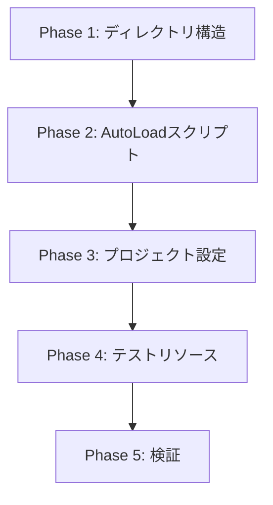
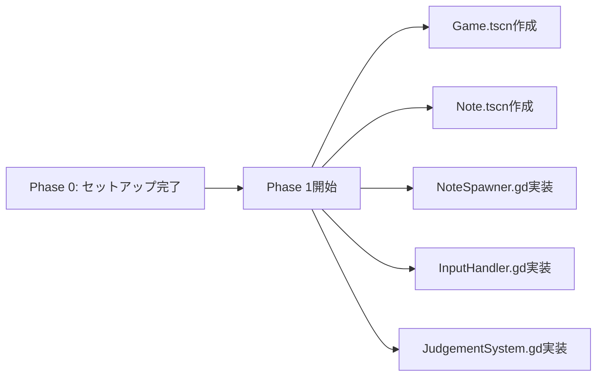

# Design Document - Project Setup

**機能名**: project-setup  
**フェーズ**: 設計  
**作成日**: 2025-09-30  
**基準ドキュメント**: `docs/要件定義書.md`, `docs/詳細設計書.md`

---

## 1. 設計概要

このドキュメントは、Godot 4.5リズムゲームプロジェクトの初期セットアップフェーズにおける実装設計を定義します。要件定義書で定義された要件を、実装可能な具体的な手順とファイル構造に落とし込みます。

### 1.1 設計原則

- **疎結合アーキテクチャ**: AutoLoadシステムによる責務の明確な分離
- **段階的検証**: 各コンポーネントを個別にテスト可能な構造
- **型安全性**: GDScriptの型ヒントを全面的に活用
- **エラーハンドリング**: ファイルI/O失敗時の適切なフォールバック

### 1.2 実装の優先順位



---

## 2. ディレクトリ構造設計

### 2.1 ディレクトリツリー（完全版）

```
project/
├── .godot/                        # Godot生成ファイル（自動作成）
├── .kiro/                         # 仕様管理ディレクトリ（既存）
│   └── specs/
│       └── project-setup/
├── docs/                          # ドキュメント（既存）
├── scenes/                        # ★作成
│   └── UI/                        # ★作成
├── scripts/                       # ★作成
│   ├── autoload/                  # ★作成
│   ├── game/                      # ★作成
│   ├── ui/                        # ★作成
│   └── editor/                    # ★作成
├── assets/                        # ★作成
│   ├── music/                     # ★作成
│   ├── charts/                    # ★作成
│   ├── textures/                  # ★作成
│   │   ├── notes/                 # ★作成
│   │   └── ui/                    # ★作成
│   └── fonts/                     # ★作成
├── addons/                        # ★作成
├── project.godot                  # Godotプロジェクトファイル（既存または作成）
└── audio_bus_layout.tres          # ★作成
```

### 2.2 ディレクトリ作成戦略（Windows対応）

PowerShellの実行ポリシー制限を考慮し、以下の方法で作成：

**方法1: Godotエディタで作成**（推奨）
- Godotエディタの「FileSystem」パネルから右クリック → 「New Folder」

**方法2: 手動作成**
- エクスプローラーで直接作成

**方法3: `.gitkeep`ファイルによる保持**
```
scenes/.gitkeep
scripts/autoload/.gitkeep
scripts/game/.gitkeep
scripts/ui/.gitkeep
scripts/editor/.gitkeep
assets/music/.gitkeep
assets/charts/.gitkeep
assets/textures/notes/.gitkeep
assets/textures/ui/.gitkeep
assets/fonts/.gitkeep
addons/.gitkeep
```

---

## 3. AutoLoadスクリプト詳細設計

### 3.1 GameConfig.gd

**ファイルパス**: `res://scripts/autoload/GameConfig.gd`

**設計方針**:
- すべての設定値を`const`として定義（実行時変更不可）
- デバッグモードのみ`var`で可変
- 列挙型（`enum`）で難易度を型安全に管理

**完全実装コード**:

```gdscript
# res://scripts/autoload/GameConfig.gd
extends Node

# ===== タイミング判定ウィンドウ（秒） =====
const PERFECT_WINDOW: float = 0.025  # ±25ms
const GOOD_WINDOW: float = 0.050     # ±50ms
const OK_WINDOW: float = 0.080       # ±80ms
const MISS_WINDOW: float = 0.150     # ±150ms（これ以上は無視）

# ===== スコアリング =====
const SCORE_PERFECT: int = 100
const SCORE_GOOD: int = 70
const SCORE_OK: int = 40
const SCORE_MISS: int = 0

# コンボボーナス（コンボ数に応じた倍率）
const COMBO_MULTIPLIER: Dictionary = {
	10: 1.1,   # 10コンボで1.1倍
	25: 1.2,   # 25コンボで1.2倍
	50: 1.5,   # 50コンボで1.5倍
	100: 2.0   # 100コンボで2.0倍
}

# ===== ノート設定 =====
const NOTE_SPEED: float = 600.0  # pixels per second
const JUDGEMENT_LINE_Y: float = 600.0  # 判定ラインのY座標

# ===== キーマッピング =====
const KEY_MAPPINGS: Dictionary = {
	0: KEY_D,
	1: KEY_F,
	2: KEY_J,
	3: KEY_K
}

# レーン位置（X座標）
const LANE_POSITIONS: Array[float] = [400.0, 520.0, 640.0, 760.0]

# ===== 難易度設定 =====
enum Difficulty {
	EASY,
	NORMAL,
	HARD,
	EXPERT
}

const DIFFICULTY_NAMES: Dictionary = {
	Difficulty.EASY: "Easy",
	Difficulty.NORMAL: "Normal",
	Difficulty.HARD: "Hard",
	Difficulty.EXPERT: "Expert"
}

# ===== デバッグ設定 =====
var debug_mode: bool = false

func _ready() -> void:
	print("[GameConfig] Initialized")

func get_combo_multiplier(combo: int) -> float:
	"""現在のコンボ数に対する倍率を取得"""
	var multiplier := 1.0
	for threshold in COMBO_MULTIPLIER.keys():
		if combo >= threshold:
			multiplier = COMBO_MULTIPLIER[threshold]
	return multiplier

func get_judgement_window(judgement: String) -> float:
	"""判定種別に対応するウィンドウ時間を取得"""
	match judgement:
		"PERFECT": return PERFECT_WINDOW
		"GOOD": return GOOD_WINDOW
		"OK": return OK_WINDOW
		"MISS": return MISS_WINDOW
		_: return 0.0
```

**検証ポイント**:
- ✅ 構文エラーがないこと
- ✅ `_ready()`でログが出力されること
- ✅ `get_combo_multiplier(50)`が`1.5`を返すこと
- ✅ `get_judgement_window("PERFECT")`が`0.025`を返すこと

---

### 3.2 ScoreManager.gd

**ファイルパス**: `res://scripts/autoload/ScoreManager.gd`

**設計方針**:
- シグナル駆動設計：状態変更時に必ずシグナルを発火
- 統計データの一元管理
- 精度計算の重み付けロジック（PERFECT: 100%, GOOD: 70%, OK: 40%）

**完全実装コード**:

```gdscript
# res://scripts/autoload/ScoreManager.gd
extends Node

# ===== シグナル =====
signal score_updated(new_score: int)
signal combo_changed(new_combo: int)
signal judgement_made(judgement: String, delta_time: float)
signal accuracy_updated(accuracy: float)

# ===== 状態変数 =====
var current_score: int = 0
var current_combo: int = 0
var max_combo: int = 0

# 統計
var judgement_counts: Dictionary = {
	"PERFECT": 0,
	"GOOD": 0,
	"OK": 0,
	"MISS": 0
}

var total_notes: int = 0

func _ready() -> void:
	print("[ScoreManager] Initialized")

func reset_game() -> void:
	"""ゲーム開始時にリセット"""
	current_score = 0
	current_combo = 0
	max_combo = 0
	judgement_counts = {
		"PERFECT": 0,
		"GOOD": 0,
		"OK": 0,
		"MISS": 0
	}
	score_updated.emit(0)
	combo_changed.emit(0)

func add_judgement(judgement: String, delta_time: float) -> void:
	"""判定を追加してスコアを計算"""
	judgement_counts[judgement] += 1
	
	if judgement == "MISS":
		current_combo = 0
	else:
		current_combo += 1
		max_combo = max(max_combo, current_combo)
	
	# スコア計算（コンボ倍率適用）
	var base_score := 0
	match judgement:
		"PERFECT": base_score = GameConfig.SCORE_PERFECT
		"GOOD": base_score = GameConfig.SCORE_GOOD
		"OK": base_score = GameConfig.SCORE_OK
		"MISS": base_score = GameConfig.SCORE_MISS
	
	var multiplier := GameConfig.get_combo_multiplier(current_combo)
	var final_score := int(base_score * multiplier)
	current_score += final_score
	
	# シグナル発火
	score_updated.emit(current_score)
	combo_changed.emit(current_combo)
	judgement_made.emit(judgement, delta_time)
	
	# 精度計算
	var total := float(judgement_counts.values().reduce(func(a, b): return a + b, 0))
	if total > 0:
		var accuracy := (judgement_counts["PERFECT"] + judgement_counts["GOOD"] * 0.7 + judgement_counts["OK"] * 0.4) / total * 100.0
		accuracy_updated.emit(accuracy)

func get_accuracy() -> float:
	"""現在の精度（%）を取得"""
	var total := float(judgement_counts.values().reduce(func(a, b): return a + b, 0))
	if total == 0:
		return 0.0
	return (judgement_counts["PERFECT"] + judgement_counts["GOOD"] * 0.7 + judgement_counts["OK"] * 0.4) / total * 100.0

func get_grade() -> String:
	"""精度に基づいてグレードを返す"""
	var acc := get_accuracy()
	if acc >= 95.0:
		return "S"
	elif acc >= 90.0:
		return "A"
	elif acc >= 80.0:
		return "B"
	elif acc >= 70.0:
		return "C"
	else:
		return "D"
```

**検証ポイント**:
- ✅ `reset_game()`でシグナルが発火すること
- ✅ `add_judgement("PERFECT", 0.0)`でスコアが100加算されること
- ✅ コンボ10以上で倍率が適用されること
- ✅ `get_grade()`が正しいグレードを返すこと

---

### 3.3 ChartLoader.gd

**ファイルパス**: `res://scripts/autoload/ChartLoader.gd`

**設計方針**:
- キャッシュ機構による重複読み込み防止
- 厳格なバリデーション
- エラー時は空の辞書を返し、ログで詳細を報告

**完全実装コード**:

```gdscript
# res://scripts/autoload/ChartLoader.gd
extends Node

# ロード済み譜面のキャッシュ
var chart_cache: Dictionary = {}

func _ready() -> void:
	print("[ChartLoader] Initialized")

func load_chart(file_path: String) -> Dictionary:
	"""譜面JSONファイルを読み込む"""
	# キャッシュチェック
	if chart_cache.has(file_path):
		return chart_cache[file_path]
	
	# ファイル読み込み
	if not FileAccess.file_exists(file_path):
		push_error("[ChartLoader] File not found: " + file_path)
		return {}
	
	var file := FileAccess.open(file_path, FileAccess.READ)
	if file == null:
		push_error("[ChartLoader] Failed to open file: " + file_path)
		return {}
	
	var json_string := file.get_as_text()
	file.close()
	
	# JSON解析
	var json := JSON.new()
	var error := json.parse(json_string)
	if error != OK:
		push_error("[ChartLoader] JSON Parse Error at line %d: %s" % [json.get_error_line(), json.get_error_message()])
		return {}
	
	var data: Dictionary = json.data
	
	# バリデーション
	if not validate_chart(data):
		push_error("[ChartLoader] Invalid chart format: " + file_path)
		return {}
	
	# キャッシュに保存
	chart_cache[file_path] = data
	
	print("[ChartLoader] Loaded chart: " + file_path)
	return data

func validate_chart(data: Dictionary) -> bool:
	"""譜面データの妥当性を検証"""
	if not data.has("metadata") or not data.has("notes"):
		return false
	
	var metadata: Dictionary = data["metadata"]
	var required_keys := ["song_title", "artist", "bpm", "offset_sec", "song_path"]
	for key in required_keys:
		if not metadata.has(key):
			push_error("[ChartLoader] Missing metadata key: " + key)
			return false
	
	# ノートの検証
	var notes: Array = data["notes"]
	for note in notes:
		if not note.has("beat") or not note.has("lane"):
			return false
		if note["lane"] < 0 or note["lane"] > 3:
			return false
	
	return true

func save_chart(file_path: String, chart_data: Dictionary) -> Error:
	"""譜面データをJSONファイルに保存"""
	var file := FileAccess.open(file_path, FileAccess.WRITE)
	if file == null:
		push_error("[ChartLoader] Failed to create file: " + file_path)
		return FileAccess.get_open_error()
	
	var json_string := JSON.stringify(chart_data, "  ", false)
	file.store_string(json_string)
	file.close()
	
	# キャッシュ更新
	chart_cache[file_path] = chart_data
	
	print("[ChartLoader] Saved chart: " + file_path)
	return OK

func get_all_charts() -> Array[String]:
	"""利用可能な全譜面ファイルのパスを取得"""
	var charts: Array[String] = []
	var dir := DirAccess.open("res://assets/charts/")
	if dir:
		dir.list_dir_begin()
		var file_name := dir.get_next()
		while file_name != "":
			if not dir.current_is_dir() and file_name.ends_with(".json"):
				charts.append("res://assets/charts/" + file_name)
			file_name = dir.get_next()
	return charts
```

**検証ポイント**:
- ✅ 存在しないファイルで空の辞書が返ること
- ✅ バリデーションで必須キー不足を検出すること
- ✅ レーン番号範囲外（-1, 4）でバリデーションエラーになること
- ✅ 正しい譜面ファイルで`validate_chart()`が`true`を返すこと

---

## 4. プロジェクト設定設計

### 4.1 project.godot設定内容

**手動編集箇所**（Godotエディタから設定推奨）:

```ini
[application]
config/name="Rhythm Game"
run/main_scene="res://scenes/Main.tscn"
config/features=PackedStringArray("4.5", "Forward Plus")

[display]
window/size/viewport_width=1280
window/size/viewport_height=720
window/size/mode=2  # 0=Fullscreen, 2=Windowed
window/size/resizable=true
window/stretch/mode="canvas_items"
window/stretch/aspect="expand"

[audio]
buses/default_bus_layout="res://audio_bus_layout.tres"

[autoload]
GameConfig="*res://scripts/autoload/GameConfig.gd"
ScoreManager="*res://scripts/autoload/ScoreManager.gd"
ChartLoader="*res://scripts/autoload/ChartLoader.gd"

[input]
lane_0={
"deadzone": 0.5,
"events": [Object(InputEventKey,"resource_local_to_scene":false,"resource_name":"","device":0,"window_id":0,"alt_pressed":false,"shift_pressed":false,"ctrl_pressed":false,"meta_pressed":false,"pressed":false,"keycode":0,"physical_keycode":68,"key_label":0,"unicode":0,"location":0,"echo":false,"script":null)]
}

lane_1={
"deadzone": 0.5,
"events": [Object(InputEventKey,"resource_local_to_scene":false,"resource_name":"","device":0,"window_id":0,"alt_pressed":false,"shift_pressed":false,"ctrl_pressed":false,"meta_pressed":false,"pressed":false,"keycode":0,"physical_keycode":70,"key_label":0,"unicode":0,"location":0,"echo":false,"script":null)]
}

lane_2={
"deadzone": 0.5,
"events": [Object(InputEventKey,"resource_local_to_scene":false,"resource_name":"","device":0,"window_id":0,"alt_pressed":false,"shift_pressed":false,"ctrl_pressed":false,"meta_pressed":false,"pressed":false,"keycode":0,"physical_keycode":74,"key_label":0,"unicode":0,"location":0,"echo":false,"script":null)]
}

lane_3={
"deadzone": 0.5,
"events": [Object(InputEventKey,"resource_local_to_scene":false,"resource_name":"","device":0,"window_id":0,"alt_pressed":false,"shift_pressed":false,"ctrl_pressed":false,"meta_pressed":false,"pressed":false,"keycode":0,"physical_keycode":75,"key_label":0,"unicode":0,"location":0,"echo":false,"script":null)]
}

toggle_debug={
"deadzone": 0.5,
"events": [Object(InputEventKey,"resource_local_to_scene":false,"resource_name":"","device":0,"window_id":0,"alt_pressed":false,"shift_pressed":false,"ctrl_pressed":false,"meta_pressed":false,"pressed":false,"keycode":0,"physical_keycode":4194332,"key_label":0,"unicode":0,"location":0,"echo":false,"script":null)]
}
```

### 4.2 Input Map設定手順（Godotエディタ）

1. **プロジェクト → プロジェクト設定 → Input Map**を開く
2. 各アクションを追加：
   - `lane_0` → キー`D`（物理キーコード68）
   - `lane_1` → キー`F`（物理キーコード70）
   - `lane_2` → キー`J`（物理キーコード74）
   - `lane_3` → キー`K`（物理キーコード75）
   - `toggle_debug` → キー`F3`（物理キーコード4194332）
3. すべて**Physical Key**（物理キー）として設定
4. **Echo**はすべて無効化

### 4.3 audio_bus_layout.tres設計

**ファイルパス**: `audio_bus_layout.tres`

Godotエディタから作成：

1. **Audio → Audio Buses**パネルを開く
2. **Master**バス（デフォルト存在）
3. **Add Bus**で以下を追加：
   - **Music** (Send to: Master)
   - **SFX** (Send to: Master)
4. **Save As** → `audio_bus_layout.tres`として保存

**期待される構造**:
```
Master (0dB)
├── Music (0dB)
└── SFX (0dB)
```

---

## 5. テストリソース設計

### 5.1 サンプル譜面ファイル

**ファイルパス**: `res://assets/charts/test_song.json`

**内容**:
```json
{
  "metadata": {
    "song_title": "Test Song - Basic Pattern",
    "artist": "Test Artist",
    "bpm": 120.0,
    "offset_sec": 2.0,
    "song_path": "res://assets/music/test_song.wav",
    "difficulty": "Normal",
    "chart_author": "System",
    "created_date": "2025-09-30"
  },
  "notes": [
    { "beat": 0.0, "lane": 0 },
    { "beat": 0.5, "lane": 1 },
    { "beat": 1.0, "lane": 2 },
    { "beat": 1.5, "lane": 3 },
    { "beat": 2.0, "lane": 0 },
    { "beat": 2.0, "lane": 2 },
    { "beat": 2.5, "lane": 1 },
    { "beat": 2.5, "lane": 3 },
    { "beat": 3.0, "lane": 0 },
    { "beat": 3.5, "lane": 1 },
    { "beat": 4.0, "lane": 2 },
    { "beat": 4.5, "lane": 3 }
  ]
}
```

**特徴**:
- 12ノート（4拍分）
- 0.5拍刻みのシンプルなパターン
- 同時押し1箇所（beat 2.0でレーン0と2）
- 全レーン使用

### 5.2 サンプル音楽ファイル

**ファイルパス**: `res://assets/music/test_song.wav`

**仕様**:
- BPM: 120
- 長さ: 最低8秒（譜面は4拍 = 2秒、オフセット2秒含む）
- フォーマット: WAV、44.1kHz、16bit、Stereo

**生成方法**（オプション）:
- Audacityなどで120BPMのクリック音を生成
- または既存のロイヤリティフリー音源を使用

### 5.3 プレースホルダーテクスチャ

#### ノートテクスチャ
**ファイルパス**: `res://assets/textures/notes/note_placeholder.png`

**仕様**:
- サイズ: 64x64ピクセル
- 内容: 白色の円（中央に配置）
- 背景: 透明

#### 背景テクスチャ
**ファイルパス**: `res://assets/textures/ui/background_placeholder.png`

**仕様**:
- サイズ: 1280x720ピクセル
- 内容: 上から下へのグラデーション（濃い青 → 黒）

---

## 6. 検証設計

### 6.1 検証スクリプト設計

**目的**: セットアップ完了後の自動検証

**ファイルパス**: `scripts/test_setup.gd`（一時的）

```gdscript
# res://scripts/test_setup.gd
extends Node

func _ready() -> void:
	print("=== Project Setup Verification ===")
	
	# 1. AutoLoad検証
	verify_autoload()
	
	# 2. ディレクトリ検証
	verify_directories()
	
	# 3. 譜面ファイル検証
	verify_chart()
	
	print("=== Verification Complete ===")

func verify_autoload() -> void:
	print("\n[1] Verifying AutoLoad...")
	
	# GameConfig
	assert(GameConfig != null, "GameConfig not loaded")
	assert(GameConfig.PERFECT_WINDOW == 0.025, "PERFECT_WINDOW incorrect")
	assert(GameConfig.get_combo_multiplier(50) == 1.5, "Combo multiplier incorrect")
	print("✅ GameConfig OK")
	
	# ScoreManager
	assert(ScoreManager != null, "ScoreManager not loaded")
	ScoreManager.reset_game()
	assert(ScoreManager.current_score == 0, "Reset failed")
	print("✅ ScoreManager OK")
	
	# ChartLoader
	assert(ChartLoader != null, "ChartLoader not loaded")
	print("✅ ChartLoader OK")

func verify_directories() -> void:
	print("\n[2] Verifying Directories...")
	
	var required_dirs := [
		"res://scenes/",
		"res://scripts/autoload/",
		"res://assets/music/",
		"res://assets/charts/"
	]
	
	for dir_path in required_dirs:
		assert(DirAccess.dir_exists_absolute(dir_path), "Missing: " + dir_path)
	
	print("✅ All directories exist")

func verify_chart() -> void:
	print("\n[3] Verifying Chart File...")
	
	var chart_path := "res://assets/charts/test_song.json"
	var chart := ChartLoader.load_chart(chart_path)
	
	assert(not chart.is_empty(), "Chart loading failed")
	assert(chart["metadata"]["bpm"] == 120.0, "BPM incorrect")
	assert(chart["notes"].size() == 12, "Note count incorrect")
	assert(ChartLoader.validate_chart(chart), "Chart validation failed")
	
	print("✅ Chart file OK")
```

**実行方法**:
1. 新規シーン作成
2. Nodeを追加し、`test_setup.gd`をアタッチ
3. シーン実行
4. Output Logで結果確認

### 6.2 手動検証チェックリスト

```markdown
## セットアップ検証チェックリスト

### ディレクトリ構造
- [ ] `scenes/` ディレクトリが存在する
- [ ] `scenes/UI/` サブディレクトリが存在する
- [ ] `scripts/autoload/` ディレクトリが存在する
- [ ] `scripts/game/` ディレクトリが存在する
- [ ] `scripts/ui/` ディレクトリが存在する
- [ ] `scripts/editor/` ディレクトリが存在する
- [ ] `assets/music/` ディレクトリが存在する
- [ ] `assets/charts/` ディレクトリが存在する
- [ ] `assets/textures/notes/` ディレクトリが存在する
- [ ] `assets/textures/ui/` ディレクトリが存在する
- [ ] `assets/fonts/` ディレクトリが存在する
- [ ] `addons/` ディレクトリが存在する

### AutoLoadスクリプト
- [ ] `GameConfig.gd` が存在し、エラーなくロードできる
- [ ] `ScoreManager.gd` が存在し、エラーなくロードできる
- [ ] `ChartLoader.gd` が存在し、エラーなくロードできる
- [ ] プロジェクト設定のAutoLoadセクションに3つすべて登録されている

### Input Map
- [ ] `lane_0` アクションが存在し、Dキーにマッピングされている
- [ ] `lane_1` アクションが存在し、Fキーにマッピングされている
- [ ] `lane_2` アクションが存在し、Jキーにマッピングされている
- [ ] `lane_3` アクションが存在し、Kキーにマッピングされている
- [ ] `toggle_debug` アクションが存在し、F3キーにマッピングされている

### プロジェクト設定
- [ ] ウィンドウサイズが1280x720に設定されている
- [ ] ストレッチモードが"canvas_items"に設定されている
- [ ] `audio_bus_layout.tres` が存在する
- [ ] Master, Music, SFXの3つのバスが定義されている

### テストリソース
- [ ] `test_song.json` が存在し、正しいJSON形式である
- [ ] `test_song.wav` が存在し、再生可能である
- [ ] `ChartLoader.validate_chart()` がtest_song.jsonで`true`を返す

### エディタ起動
- [ ] Godotエディタでプロジェクトがエラーなく開ける
- [ ] Output Logに"[GameConfig] Initialized"が表示される
- [ ] Output Logに"[ScoreManager] Initialized"が表示される
- [ ] Output Logに"[ChartLoader] Initialized"が表示される
```

---

## 7. トラブルシューティング

### 7.1 よくある問題と対処法

#### 問題1: AutoLoadが認識されない

**症状**: `GameConfig.PERFECT_WINDOW`でエラー

**原因**: AutoLoad登録が未完了

**対処法**:
1. プロジェクト → プロジェクト設定 → AutoLoad
2. スクリプトパスが正しいか確認
3. シングルトン（`*`マーク）が有効か確認

#### 問題2: JSONパースエラー

**症状**: `[ChartLoader] JSON Parse Error`

**原因**: JSON構文エラー（カンマ忘れ、引用符ミスなど）

**対処法**:
1. オンラインJSON Validatorで検証
2. エラー行番号をチェック
3. UTF-8（BOMなし）で保存されているか確認

#### 問題3: Input Mapが反応しない

**症状**: キー入力が検出されない

**原因**: Physical Keyではなく通常のKeyが設定されている

**対処法**:
1. Input Map設定を削除
2. 再追加時に**Physical Key**を選択

#### 問題4: PowerShellスクリプトブロック

**症状**: `ScriptContainedMaliciousContent`エラー

**対処法**:
- ファイル作成はGodotエディタまたはエクスプローラーを使用
- スクリプトでディレクトリ作成は試みない

---

## 8. 実装完了条件

以下のすべてを満たした時点でPhase 0（プロジェクトセットアップ）完了とみなす：

### 8.1 必須条件

1. ✅ **ディレクトリ構造**: セクション2.1の全ディレクトリが存在
2. ✅ **AutoLoadスクリプト**: GameConfig.gd, ScoreManager.gd, ChartLoader.gdが動作
3. ✅ **プロジェクト設定**: project.godotに必要な設定がすべて記述
4. ✅ **Input Map**: 5つのアクションが正しく設定
5. ✅ **オーディオバス**: audio_bus_layout.tresに3バス定義
6. ✅ **テストリソース**: test_song.json, test_song.wav, プレースホルダー画像が配置
7. ✅ **検証**: セクション6.2のチェックリストがすべて✅

### 8.2 品質条件

1. ✅ **エラーなし**: Godotエディタ起動時にエラーログがゼロ
2. ✅ **型安全**: すべてのGDScriptで型ヒントが使用されている
3. ✅ **ログ出力**: 各AutoLoadの`_ready()`でログが出力される
4. ✅ **バリデーション**: ChartLoaderがtest_song.jsonを検証できる

---

## 9. 次フェーズへの引き継ぎ事項

### 9.1 Phase 1（コアゲームプレイ）への準備

Phase 0完了後、以下が整備されている：

- **AutoLoadシステム**: GameConfig, ScoreManager, ChartLoader利用可能
- **譜面データ**: test_song.jsonで動作確認可能
- **Input Map**: 4レーン入力が即座に実装可能
- **ディレクトリ**: Game.gd, Note.gdなどの配置先が明確

### 9.2 Phase 1で実装する主要コンポーネント



---

## 10. 参考情報

### 10.1 使用するGodot 4.5 API

- **FileAccess**: ファイル読み書き
  - `FileAccess.file_exists()`
  - `FileAccess.open()`
  - `FileAccess.get_as_text()`
- **DirAccess**: ディレクトリ操作
  - `DirAccess.open()`
  - `DirAccess.dir_exists_absolute()`
  - `DirAccess.list_dir_begin()`
- **JSON**: JSON解析
  - `JSON.parse()`
  - `JSON.stringify()`
- **Signal**: イベント通知
  - `signal`キーワード
  - `.emit()`メソッド

### 10.2 関連ドキュメント

- `docs/要件定義書.md`: アーキテクチャ思想
- `docs/詳細設計書.md`: セクション2（技術仕様）、セクション3（アーキテクチャ設計）
- Godot公式ドキュメント: [Singletons (AutoLoad)](https://docs.godotengine.org/en/stable/tutorials/scripting/singletons_autoload.html)

---

**設計レビュー完了後、タスク分解フェーズ（`/kiro/spec-tasks`）へ進んでください。**

