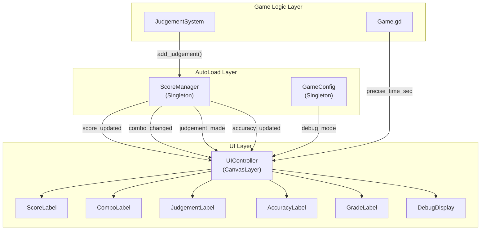
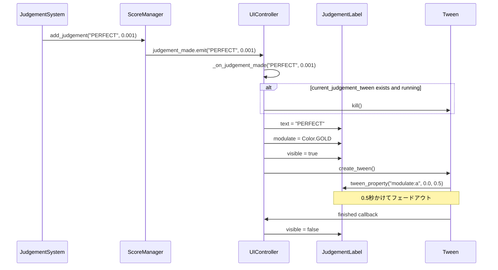
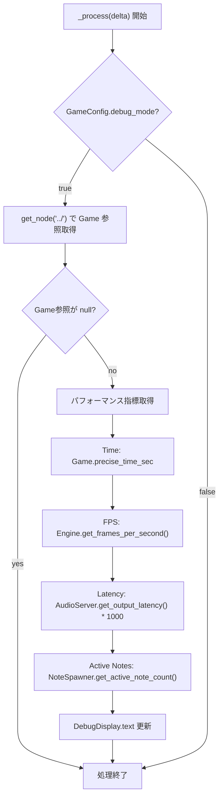
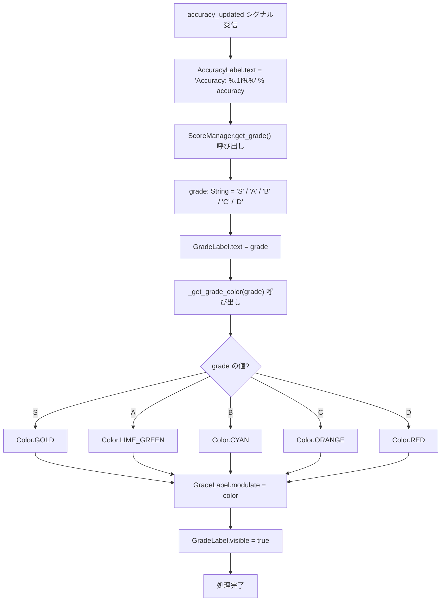
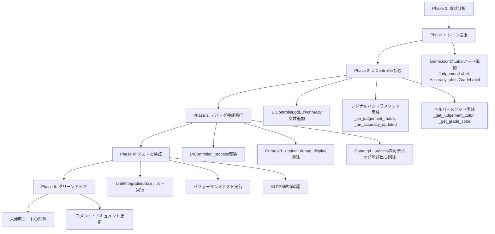

# Technical Design Document: UI実装

## Overview

UI実装フェーズは、Phase 1で完成したコアゲームプレイシステムに視覚的フィードバック層を追加します。既存のScoreManagerシグナルシステムと統合し、プレイヤーのパフォーマンスをリアルタイムで表示する包括的なUIシステムを構築します。

**目的**: プレイヤーに即座の視覚的フィードバックを提供することで、ゲームプレイ体験を向上させ、タイミング精度とパフォーマンスの認識を強化します。

**ユーザー**: リズムゲームプレイヤーは、ノートヒット判定、スコア進捗、コンボ状態、精度統計、全体的なパフォーマンスグレードをリアルタイムで確認するためにこのUIシステムを利用します。ゲーム開発者は、デバッグ表示を通じて内部状態とパフォーマンス指標を監視します。

**影響**: 既存のUIControllerスクリプトとGame.tscnシーンを拡張します。現在のスコア表示とコンボ表示の実装を保持しつつ、判定表示アニメーション、精度/グレード表示、デバッグ情報の機能を追加します。

### Goals

- ScoreManagerの4つのシグナル（score_updated, combo_changed, judgement_made, accuracy_updated）を完全に統合したUIシステムを構築する
- 判定結果（PERFECT、GOOD、OK、MISS）の視覚的フィードバックを色分けとTweenアニメーションで実装する
- プレイヤーの精度（Accuracy）とグレード（S/A/B/C/D）をリアルタイムで計算・表示する
- 開発者向けのデバッグ情報表示を実装し、パフォーマンス監視を可能にする
- 既存のゲームプレイロジックとの互換性を維持しつつ、60 FPS安定動作を保証する

### Non-Goals

- リザルト画面やメニュー画面などの追加UI画面の実装（Phase 3以降）
- UIテーマやスタイルシステムのカスタマイズ機能
- UI要素のアニメーション以外のエフェクト（パーティクル、シェーダーなど）
- 設定画面やオプション機能の実装
- ローカライゼーションやテキスト管理システム

## Architecture

### Existing Architecture Analysis

現在のアーキテクチャは、AutoLoadシングルトンパターンとシグナルベースの疎結合通信を採用しています：

**既存のアーキテクチャパターン**:
- **AutoLoadシングルトン**: GameConfig、ScoreManager、ChartLoaderが全システムからアクセス可能
- **シグナル駆動通信**: ScoreManagerが状態変化をシグナルで通知、UIが購読して更新
- **シーンツリー階層**: Game.tscn内のCanvasLayerとしてUIを配置、常に最前面表示

**保持すべきドメイン境界**:
- **ゲームロジック層**: Game.gd、NoteSpawner、JudgementSystemはUI実装に影響されない
- **状態管理層**: ScoreManagerは引き続きスコア計算とシグナル発火の責務のみを持つ
- **UI層**: UIControllerはシグナル購読と表示更新のみに専念、ビジネスロジックを含まない

**維持すべき統合ポイント**:
- ScoreManagerの4つのシグナル（score_updated, combo_changed, judgement_made, accuracy_updated）
- Game.gdからのデバッグモード制御（GameConfig.debug_mode変数）
- CanvasLayerによるUI要素の階層化と描画順序

**対処する技術的負債**:
- デバッグ表示の更新ロジックがGame.gdに実装されている問題を解決し、UIControllerに集約
- UI要素への参照がnullチェックなしで使用されている箇所をnullセーフティで強化

### High-Level Architecture



### Technology Alignment

本機能は、既存のGodot 4.5 + GDScriptスタックに完全に準拠し、新しい外部依存関係を導入しません。

**既存技術スタックとの整合性**:
- **Godot 4.5 GDScript**: すべてのUIロジックはGDScriptで実装
- **Godot組み込みUIノード**: Label、CanvasLayerなどの標準ノードを使用
- **Tweenアニメーションシステム**: Godot 4.x標準のTweenクラスでフェードアウト実装
- **シグナルシステム**: ScoreManagerの既存シグナル購読パターンを継続

**新規導入する依存関係**:
- なし（Godotの標準機能のみ使用）

**確立されたパターンからの逸脱**:
- **デバッグ表示の責務移転**: Game.gdからUIControllerへ移動
  - **理由**: UI更新ロジックの集約により、単一責任原則を遵守
  - **影響**: Game.gdの`_update_debug_display()`メソッドを削除し、UIControllerの`_process()`に統合

### Key Design Decisions

#### Decision 1: デバッグ表示の責務をUIControllerに集約

**Context**: 現在、デバッグ表示の更新ロジックはGame.gdの`_update_debug_display()`メソッドに実装されており、UI関連の責務が分散しています。

**Alternatives**:
1. **現状維持**: Game.gdでデバッグ表示を更新し続ける
2. **新規DebugControllerノード**: デバッグ専用のコントローラーを作成
3. **UIControllerに統合**: すべてのUI更新ロジックをUIControllerに集約

**Selected Approach**: UIControllerに統合（選択肢3）
- UIControllerの`_process(delta)`メソッドでGameConfig.debug_modeをチェック
- debug_mode=trueの場合のみ、Engine.get_frames_per_second()、AudioServer.get_output_latency()などのパフォーマンス指標を取得
- Game.gdへの参照を`get_node("../")`で取得し、precise_time_secとactive_note_countを読み取り

**Rationale**:
- **単一責任原則**: すべてのUI更新ロジックを1箇所に集約
- **結合度の低減**: Game.gdはUI要素への直接参照を持たなくなる
- **保守性向上**: UI関連の変更がUIControllerのみで完結

**Trade-offs**:
- **得るもの**: コードの整理、UI変更の局所化、テストの容易性
- **失うもの**: わずかなパフォーマンスオーバーヘッド（毎フレームのノード参照取得）

#### Decision 2: Tweenアニメーション管理戦略

**Context**: 判定表示のフェードアウトアニメーションは、新しい判定が発生した場合に中断して即座に新しい判定を表示する必要があります。

**Alternatives**:
1. **AnimationPlayerノード**: シーンにAnimationPlayerを追加してアニメーション管理
2. **複数Tweenインスタンス**: 判定ごとに新しいTweenを作成
3. **単一Tween管理**: UIControllerでTween参照を保持し、再利用

**Selected Approach**: 単一Tween管理（選択肢3）
- UIControllerに`current_judgement_tween: Tween`変数を追加
- 新しい判定が発生時、既存のTweenが動作中なら`kill()`で停止
- `create_tween()`で新しいTweenを作成し、`current_judgement_tween`に保存

**Rationale**:
- **リソース効率**: Tweenインスタンスを使い回すことでメモリ使用量を最小化
- **制御の明確性**: コード内でアニメーションの開始/停止を明示的に管理
- **パフォーマンス**: AnimationPlayerよりも軽量で、60 FPS維持に有利

**Trade-offs**:
- **得るもの**: 低メモリフットプリント、高速なアニメーション切り替え、シンプルなコード
- **失うもの**: AnimationPlayerのGUIエディタによる視覚的編集機能

#### Decision 3: グレード色分け方式

**Context**: グレード（S/A/B/C/D）とAccuracyを表示する際、視覚的な区別を明確にする必要があります。

**Alternatives**:
1. **テクスチャベース**: グレードごとに異なる画像アセットを用意
2. **色分けのみ**: LabelのmodulateプロパティでColor値を変更
3. **フォントサイズ可変**: グレードに応じてフォントサイズも変更

**Selected Approach**: 色分けのみ（選択肢2）
- S: Color.GOLD、A: Color.LIME_GREEN、B: Color.CYAN、C: Color.ORANGE、D: Color.RED
- `_get_grade_color(grade: String) -> Color`ヘルパーメソッドで色を返す

**Rationale**:
- **実装の簡潔性**: アセット不要、コードのみで完結
- **保守性**: 色変更が容易、新グレード追加も簡単
- **パフォーマンス**: テクスチャロードやフォントサイズ変更のオーバーヘッドなし

**Trade-offs**:
- **得るもの**: 高速実装、アセット管理不要、軽量動作
- **失うもの**: リッチなビジュアル表現（グラデーション、エフェクトなど）

## System Flows

### Judgement Display Animation Flow

判定表示のアニメーションフローは、複数の判定が連続して発生する場合の制御が重要です。



### UI Update Cycle Flow

UIControllerが各フレームで実行する更新サイクルです。



### Accuracy and Grade Update Flow

精度とグレードの更新フローは、ScoreManagerから計算された精度を受け取り、グレードを判定します。



## Requirements Traceability

| Requirement | Requirement Summary | Components | Interfaces | Flows |
|-------------|---------------------|------------|------------|-------|
| 1.1, 1.2, 1.3, 1.4 | UIController基盤システム | UIController | _ready(), signal handlers | - |
| 2.1, 2.2, 2.3, 2.4 | スコア表示システム | UIController, ScoreLabel | _on_score_updated(int) | - |
| 3.1, 3.2, 3.3, 3.4 | コンボ表示システム | UIController, ComboLabel | _on_combo_changed(int) | - |
| 4.1-4.8 | 判定表示アニメーション | UIController, JudgementLabel, Tween | _on_judgement_made(String, float) | Judgement Display Animation Flow |
| 5.1-5.8 | 精度・グレード表示 | UIController, AccuracyLabel, GradeLabel | _on_accuracy_updated(float), _get_grade_color(String) | Accuracy and Grade Update Flow |
| 6.1-6.6 | デバッグ表示システム | UIController, DebugDisplay | _process(delta) | UI Update Cycle Flow |

## Components and Interfaces

### UI Layer

#### UIController

**Responsibility & Boundaries**
- **Primary Responsibility**: ScoreManagerのシグナルを購読し、すべてのUI要素（スコア、コンボ、判定、精度、グレード、デバッグ）のテキストと表示状態を更新する
- **Domain Boundary**: UI表示層に属し、ゲームロジックやスコア計算には関与しない
- **Data Ownership**: UI要素への参照とTweenアニメーションインスタンスを所有
- **Transaction Boundary**: 各シグナルハンドラは独立して実行され、トランザクション境界なし

**Dependencies**
- **Inbound**: ScoreManager（シグナル発火元）、GameConfig（debug_mode変数）
- **Outbound**: Game.gd（デバッグ情報取得のためのノード参照）、NoteSpawner（アクティブノート数取得）
- **External**: なし（Godot標準機能のみ）

**Contract Definition**

**GDScriptクラス定義**:
```gdscript
extends CanvasLayer

# UI要素への参照
@onready var score_label: Label
@onready var combo_label: Label
@onready var judgement_label: Label
@onready var accuracy_label: Label
@onready var grade_label: Label
@onready var debug_display: Label

# アニメーション管理
var current_judgement_tween: Tween = null

# 初期化
func _ready() -> void

# シグナルハンドラ
func _on_score_updated(new_score: int) -> void
func _on_combo_changed(new_combo: int) -> void
func _on_judgement_made(judgement: String, delta_time: float) -> void
func _on_accuracy_updated(accuracy: float) -> void

# ヘルパーメソッド
func _get_judgement_color(judgement: String) -> Color
func _get_grade_color(grade: String) -> Color

# デバッグ更新
func _process(delta: float) -> void
```

**メソッド詳細**:

**_ready() -> void**
- **Preconditions**: ScoreManagerがAutoLoad登録済み、UI要素ノードがシーンツリーに存在
- **Postconditions**: 4つのシグナル（score_updated, combo_changed, judgement_made, accuracy_updated）に接続完了、初期表示設定完了
- **Invariants**: シグナル接続は1度のみ実行

**_on_score_updated(new_score: int) -> void**
- **Preconditions**: new_score >= 0、score_labelがnullでない
- **Postconditions**: score_label.text = "Score: [new_score]"
- **Invariants**: スコア表示は常に整数形式

**_on_combo_changed(new_combo: int) -> void**
- **Preconditions**: new_combo >= 0、combo_labelがnullでない
- **Postconditions**: new_combo > 0の場合はcombo_label表示、new_combo == 0の場合は非表示
- **Invariants**: コンボ0時は常に非表示

**_on_judgement_made(judgement: String, delta_time: float) -> void**
- **Preconditions**: judgementが"PERFECT"、"GOOD"、"OK"、"MISS"のいずれか、judgement_labelがnullでない
- **Postconditions**: 判定表示更新、色設定、0.5秒フェードアウトアニメーション開始
- **Invariants**: 既存のアニメーションは新しい判定で中断される

**_on_accuracy_updated(accuracy: float) -> void**
- **Preconditions**: 0.0 <= accuracy <= 100.0、accuracy_labelとgrade_labelがnullでない
- **Postconditions**: accuracy_label.text更新、grade_label.text更新、グレード色設定
- **Invariants**: 精度は小数点第1位まで表示

**_get_judgement_color(judgement: String) -> Color**
- **Preconditions**: judgementが"PERFECT"、"GOOD"、"OK"、"MISS"のいずれか
- **Postconditions**: 対応するColorオブジェクトを返す
- **Invariants**: 不明な判定の場合はColor.WHITEを返す

**_get_grade_color(grade: String) -> Color**
- **Preconditions**: gradeが"S"、"A"、"B"、"C"、"D"のいずれか
- **Postconditions**: 対応するColorオブジェクトを返す
- **Invariants**: 不明なグレードの場合はColor.WHITEを返す

**_process(delta: float) -> void**
- **Preconditions**: GameConfig.debug_modeが定義済み、debug_displayがnullでない
- **Postconditions**: debug_mode=trueの場合のみdebug_display.text更新
- **Invariants**: debug_mode=falseの場合は処理をスキップし、パフォーマンス影響なし

**State Management**
- **State Model**: ステートレス（各フレームでシグナルとGameConfigから状態を取得）
- **Persistence**: なし（永続化不要）
- **Concurrency**: シングルスレッド、Godotメインループ内で実行

**Integration Strategy**
- **Modification Approach**: 既存のUIController.gdを拡張（ファイル編集）
- **Backward Compatibility**: 既存の_on_score_updated()と_on_combo_changed()メソッドは変更せず保持
- **Migration Path**: 段階的に新しいUI要素とハンドラを追加、既存機能は動作継続

#### ScoreLabel

**Responsibility & Boundaries**
- **Primary Responsibility**: 現在のスコアをテキスト形式で表示
- **Domain Boundary**: UI表示層、受動的な表示専用ノード
- **Data Ownership**: 表示テキストのみ（データソースはScoreManager）

**Dependencies**
- **Inbound**: UIController（textプロパティ更新）
- **Outbound**: なし
- **External**: なし

**Contract Definition**
- **Node Type**: Label（Godot標準ノード）
- **Properties**: text（String）、theme_override_font_sizes/font_size（int）、horizontal_alignment（enum）
- **Update Strategy**: UIControllerから直接textプロパティを更新

#### ComboLabel

**Responsibility & Boundaries**
- **Primary Responsibility**: 現在のコンボ数をテキスト形式で表示、コンボ0時は非表示
- **Domain Boundary**: UI表示層、受動的な表示専用ノード
- **Data Ownership**: 表示テキストと可視性フラグ

**Dependencies**
- **Inbound**: UIController（textとvisibleプロパティ更新）
- **Outbound**: なし
- **External**: なし

**Contract Definition**
- **Node Type**: Label（Godot標準ノード）
- **Properties**: text（String）、visible（bool）、theme_override_font_sizes/font_size（int）
- **Update Strategy**: UIControllerからtextとvisibleプロパティを更新

#### JudgementLabel

**Responsibility & Boundaries**
- **Primary Responsibility**: 判定結果（PERFECT/GOOD/OK/MISS）を色分けで表示し、フェードアウトアニメーションを実行
- **Domain Boundary**: UI表示層、アニメーション対象ノード
- **Data Ownership**: 表示テキスト、色（modulate）、可視性フラグ

**Dependencies**
- **Inbound**: UIController（text、modulate、visibleプロパティ更新）、Tween（modulateアニメーション）
- **Outbound**: なし
- **External**: なし

**Contract Definition**
- **Node Type**: Label（Godot標準ノード）
- **Properties**: text（String）、modulate（Color）、visible（bool）、theme_override_font_sizes/font_size（int）
- **Update Strategy**: UIControllerがtext、modulate、visibleを設定後、Tweenでmodulate.aをアニメーション

#### AccuracyLabel

**Responsibility & Boundaries**
- **Primary Responsibility**: 現在の精度（Accuracy）をパーセンテージ形式で表示
- **Domain Boundary**: UI表示層、受動的な表示専用ノード
- **Data Ownership**: 表示テキスト

**Dependencies**
- **Inbound**: UIController（textプロパティ更新）
- **Outbound**: なし
- **External**: なし

**Contract Definition**
- **Node Type**: Label（Godot標準ノード）
- **Properties**: text（String）、theme_override_font_sizes/font_size（int）
- **Update Strategy**: UIControllerからtextプロパティを"Accuracy: %.1f%%" % accuracy形式で更新

#### GradeLabel

**Responsibility & Boundaries**
- **Primary Responsibility**: 現在のグレード（S/A/B/C/D）を色分けで表示
- **Domain Boundary**: UI表示層、受動的な表示専用ノード
- **Data Ownership**: 表示テキストと色（modulate）

**Dependencies**
- **Inbound**: UIController（textとmodulateプロパティ更新）
- **Outbound**: なし
- **External**: なし

**Contract Definition**
- **Node Type**: Label（Godot標準ノード）
- **Properties**: text（String）、modulate（Color）、visible（bool）、theme_override_font_sizes/font_size（int）
- **Update Strategy**: UIControllerがtextとmodulateを更新、グレード未確定時は非表示

#### DebugDisplay

**Responsibility & Boundaries**
- **Primary Responsibility**: 開発者向けのデバッグ情報（Time、FPS、Latency、Active Notes）を複数行テキストで表示
- **Domain Boundary**: UI表示層、デバッグ専用ノード
- **Data Ownership**: 表示テキストと可視性フラグ

**Dependencies**
- **Inbound**: UIController（textとvisibleプロパティ更新）
- **Outbound**: なし
- **External**: なし

**Contract Definition**
- **Node Type**: Label（Godot標準ノード）
- **Properties**: text（String）、visible（bool）、theme_override_font_sizes/font_size（int）
- **Update Strategy**: UIControllerの_process()メソッドで毎フレーム更新（debug_mode=trueの場合のみ）

## Data Models

### UI State Model

UI実装はステートレス設計を採用し、永続的な状態を保持しません。各UI要素の表示内容は、ScoreManagerとGameConfigから毎フレーム取得した状態に基づいて更新されます。

**データフロー**:
```
ScoreManager (State Source) → Signals → UIController → UI Elements (Display)
GameConfig (Config Source) → debug_mode → UIController → DebugDisplay
Game.gd (Runtime Source) → precise_time_sec → UIController → DebugDisplay
```

**表示データ構造**:

**ScoreLabelデータ**:
- **Source**: ScoreManager.current_score（int）
- **Format**: "Score: %d" % current_score
- **Update Trigger**: score_updatedシグナル

**ComboLabelデータ**:
- **Source**: ScoreManager.current_combo（int）
- **Format**: "%d COMBO" % current_combo
- **Visibility**: current_combo > 0の場合のみ表示
- **Update Trigger**: combo_changedシグナル

**JudgementLabelデータ**:
- **Source**: judgement_madeシグナル（judgement: String, delta_time: float）
- **Format**: judgement（"PERFECT" / "GOOD" / "OK" / "MISS"）
- **Color Mapping**:
  - PERFECT: Color.GOLD（#FFD700相当）
  - GOOD: Color.LIME_GREEN（#32CD32相当）
  - OK: Color.ORANGE（#FFA500相当）
  - MISS: Color.RED（#FF0000相当）
- **Animation**: modulate.a（1.0 → 0.0、0.5秒）
- **Update Trigger**: judgement_madeシグナル

**AccuracyLabelデータ**:
- **Source**: accuracy_updatedシグナル（accuracy: float）
- **Format**: "Accuracy: %.1f%%" % accuracy
- **Range**: 0.0 ~ 100.0
- **Precision**: 小数点第1位まで
- **Update Trigger**: accuracy_updatedシグナル

**GradeLabelデータ**:
- **Source**: ScoreManager.get_grade()メソッド（String）
- **Format**: "S" / "A" / "B" / "C" / "D"
- **Color Mapping**:
  - S: Color.GOLD
  - A: Color.LIME_GREEN
  - B: Color.CYAN
  - C: Color.ORANGE
  - D: Color.RED
- **Visibility**: 初回accuracy_updated受信後に表示
- **Update Trigger**: accuracy_updatedシグナル

**DebugDisplayデータ**:
- **Sources**: 
  - Game.precise_time_sec（float）
  - Engine.get_frames_per_second()（int）
  - AudioServer.get_output_latency()（float）
  - NoteSpawner.get_active_note_count()（int）
- **Format**: 複数行テキスト
  ```
  Time: %.3f
  FPS: %d
  Latency (ms): %.1f
  Active Notes: %d
  ```
- **Update Frequency**: 毎フレーム（GameConfig.debug_mode=trueの場合のみ）
- **Update Trigger**: _process(delta)メソッド

### Tween Animation State

**Tweenライフサイクル**:
1. **作成**: UIController._on_judgement_made()内で`create_tween()`
2. **設定**: `tween_property("modulate:a", 0.0, 0.5)`で0.5秒フェードアウト
3. **保存**: `current_judgement_tween`変数に参照を保持
4. **中断**: 新しい判定が発生時、`current_judgement_tween.kill()`で既存アニメーション停止
5. **完了**: アニメーション完了後、`judgement_label.visible = false`

**Tween管理データ**:
- **Variable**: current_judgement_tween: Tween（UIControllerのメンバー変数）
- **Lifecycle**: 判定ごとに作成/破棄
- **Concurrency**: 同時実行なし（新しいTweenが古いTweenを置き換え）

## Error Handling

### Error Strategy

UI層のエラー処理は、防御的プログラミングとグレースフルデグラデーションを採用します。UI要素が存在しない場合や、ノード参照が取得できない場合でも、ゲームプレイは継続します。

### Error Categories and Responses

**User Errors (4xx相当)**:
本UIシステムはユーザー入力を受け付けないため、ユーザーエラーは発生しません。

**System Errors (5xx相当)**:

**ノード参照エラー**:
- **状況**: `@onready`変数がnull（シーンツリーに対応ノードが存在しない）
- **検出**: 各シグナルハンドラ内でnullチェック
- **対応**: 該当UI要素の更新をスキップ、エラーログ出力せず静かに失敗
- **例**: 
  ```gdscript
  func _on_score_updated(new_score: int) -> void:
      if score_label == null:
          return  # 静かにスキップ
      score_label.text = "Score: %d" % new_score
  ```

**シグナル接続エラー**:
- **状況**: ScoreManagerが存在しない、またはシグナルが定義されていない
- **検出**: `_ready()`メソッド内でScoreManagerの存在確認
- **対応**: `push_error()`でエラーログ出力、UIは初期状態のまま動作継続
- **例**:
  ```gdscript
  func _ready() -> void:
      if not has_node("/root/ScoreManager"):
          push_error("[UIController] ScoreManager not found")
          return
  ```

**Tween操作エラー**:
- **状況**: `current_judgement_tween.kill()`実行時にTweenが既に破棄済み
- **検出**: `is_instance_valid(current_judgement_tween)`でインスタンス有効性チェック
- **対応**: 無効なTweenへのアクセスをスキップ
- **例**:
  ```gdscript
  if current_judgement_tween != null and is_instance_valid(current_judgement_tween):
      current_judgement_tween.kill()
  ```

**デバッグ情報取得エラー**:
- **状況**: Game.gdノード参照が取得できない、NoteSpawnerが存在しない
- **検出**: `get_node("../")`のnullチェック
- **対応**: デバッグ表示を"N/A"または"Error"で埋める、ゲームプレイは継続
- **例**:
  ```gdscript
  var game = get_node("../")
  if game == null:
      debug_display.text = "Time: N/A\nFPS: N/A\nLatency: N/A\nActive Notes: N/A"
      return
  ```

**Business Logic Errors (422相当)**:

**不正な判定文字列**:
- **状況**: `_on_judgement_made()`で想定外の判定文字列（例: "SUPER"）を受信
- **検出**: `_get_judgement_color()`メソッド内でmatch文の`_`ケース
- **対応**: Color.WHITEをデフォルト色として返す
- **例**:
  ```gdscript
  func _get_judgement_color(judgement: String) -> Color:
      match judgement:
          "PERFECT": return Color.GOLD
          "GOOD": return Color.LIME_GREEN
          "OK": return Color.ORANGE
          "MISS": return Color.RED
          _: return Color.WHITE  # デフォルト
  ```

**範囲外の精度値**:
- **状況**: accuracy_updatedシグナルで100.0を超える値、または負の値を受信
- **検出**: `_on_accuracy_updated()`内でclamp処理
- **対応**: 0.0~100.0の範囲にクランプして表示
- **例**:
  ```gdscript
  func _on_accuracy_updated(accuracy: float) -> void:
      var clamped_accuracy = clampf(accuracy, 0.0, 100.0)
      accuracy_label.text = "Accuracy: %.1f%%" % clamped_accuracy
  ```

### Monitoring

**ログ出力戦略**:
- **初期化ログ**: UIController._ready()で"[UIController] Initialized"を出力
- **エラーログ**: push_error()で重大なエラー（ScoreManager未検出など）を出力
- **デバッグログ**: GameConfig.debug_mode=true時のみ、詳細情報をDebugDisplayに表示

**パフォーマンス監視**:
- **FPS追跡**: Engine.get_frames_per_second()でフレームレート監視、60 FPS未満が継続する場合は最適化が必要
- **レイテンシ監視**: AudioServer.get_output_latency()で音声遅延を監視、50ms超過で警告
- **メモリ監視**: Tweenインスタンスの作成/破棄を追跡、メモリリークがないことを確認

**ヘルスチェック**:
本UIシステムは受動的な表示層のため、能動的なヘルスチェックは不要です。ScoreManagerシグナルが正常に受信できていれば、システムは健全です。

## Testing Strategy

### Unit Tests

UIControllerの各メソッドを独立してテストします。GDScriptのGUT（Godot Unit Test）フレームワークを使用します。

1. **_get_judgement_color()テスト**
   - **目的**: 各判定文字列に対して正しいColor値を返すことを検証
   - **テストケース**:
     - "PERFECT" → Color.GOLD
     - "GOOD" → Color.LIME_GREEN
     - "OK" → Color.ORANGE
     - "MISS" → Color.RED
     - "INVALID" → Color.WHITE（デフォルト）

2. **_get_grade_color()テスト**
   - **目的**: 各グレード文字列に対して正しいColor値を返すことを検証
   - **テストケース**:
     - "S" → Color.GOLD
     - "A" → Color.LIME_GREEN
     - "B" → Color.CYAN
     - "C" → Color.ORANGE
     - "D" → Color.RED
     - "F" → Color.WHITE（デフォルト）

3. **_on_score_updated() nullセーフティテスト**
   - **目的**: score_labelがnullの場合でもクラッシュしないことを検証
   - **テストケース**:
     - score_label = null、_on_score_updated(1000)呼び出し → エラーなし

4. **_on_combo_changed() 表示/非表示ロジックテスト**
   - **目的**: コンボ値に応じて正しく表示/非表示が切り替わることを検証
   - **テストケース**:
     - _on_combo_changed(0) → combo_label.visible = false
     - _on_combo_changed(10) → combo_label.visible = true、text = "10 COMBO"

5. **_on_accuracy_updated() クランプテスト**
   - **目的**: 範囲外の精度値が正しくクランプされることを検証
   - **テストケース**:
     - _on_accuracy_updated(-10.0) → "Accuracy: 0.0%"
     - _on_accuracy_updated(150.0) → "Accuracy: 100.0%"
     - _on_accuracy_updated(85.5) → "Accuracy: 85.5%"

### Integration Tests

UIControllerとScoreManagerの統合をテストします。

1. **ScoreManagerシグナル統合テスト**
   - **目的**: ScoreManagerからのシグナルがUIControllerに正しく伝達されることを検証
   - **テストケース**:
     - ScoreManager.add_judgement("PERFECT", 0.001)実行 → judgement_label.text = "PERFECT"、modulate = Color.GOLD
     - ScoreManager.current_score = 5000、score_updated.emit(5000) → score_label.text = "Score: 5000"

2. **複数シグナル連続発火テスト**
   - **目的**: 短時間に複数のシグナルが発火しても正しく処理されることを検証
   - **テストケース**:
     - score_updated、combo_changed、judgement_made、accuracy_updatedを連続発火 → 全UI要素が正しく更新される

3. **Tweenアニメーション中断テスト**
   - **目的**: 判定アニメーション中に新しい判定が発生した場合、古いアニメーションが中断されることを検証
   - **テストケース**:
     - _on_judgement_made("GOOD", 0.0)実行 → 0.2秒待機 → _on_judgement_made("PERFECT", 0.0)実行 → 古いTweenが停止、新しいTweenが開始

4. **デバッグモード切り替えテスト**
   - **目的**: GameConfig.debug_modeの切り替えがDebugDisplayの可視性に反映されることを検証
   - **テストケース**:
     - GameConfig.debug_mode = true → _process(0.016)実行 → debug_display.text更新
     - GameConfig.debug_mode = false → _process(0.016)実行 → debug_display.text未更新

5. **グレード計算統合テスト**
   - **目的**: ScoreManager.get_grade()の結果が正しくGradeLabelに反映されることを検証
   - **テストケース**:
     - ScoreManager.judgement_counts = {"PERFECT": 10, "GOOD": 0, "OK": 0, "MISS": 0} → accuracy_updated.emit(100.0) → grade_label.text = "S"、modulate = Color.GOLD

### E2E Tests

実際のゲームプレイシナリオでUI表示をテストします。

1. **完全ゲームプレイフローテスト**
   - **目的**: ゲーム開始からノートヒット、コンボ積み上げ、ゲーム終了までのUI表示が正しく動作することを検証
   - **シナリオ**:
     - ゲーム起動 → 譜面読み込み → 音楽再生開始 → ノートヒット（PERFECT） → スコア表示更新 → コンボ表示更新 → 精度/グレード表示更新 → ゲーム終了

2. **コンボブレイクシナリオテスト**
   - **目的**: コンボがブレイクした際の表示変化をテスト
   - **シナリオ**:
     - 10コンボ達成 → combo_label.visible = true → MISS判定 → combo_label.visible = false

3. **デバッグ表示リアルタイム更新テスト**
   - **目的**: デバッグ情報が毎フレーム正しく更新されることを検証
   - **シナリオ**:
     - GameConfig.debug_mode = true → ゲームプレイ開始 → DebugDisplayが毎フレーム更新される → FPS、Time、Latencyが変化する

4. **高速連打シナリオテスト**
   - **目的**: 短時間に大量の判定が発生しても正しく表示されることを検証
   - **シナリオ**:
     - 4レーン同時ノート × 10回連続 → 判定表示が高速で切り替わる → スコア/コンボ/精度が正しく更新される

5. **長時間プレイ安定性テスト**
   - **目的**: 長時間プレイしてもメモリリークやパフォーマンス低下がないことを検証
   - **シナリオ**:
     - 5分間の譜面を連続プレイ → FPSが60を維持 → メモリ使用量が増加しない

### Performance Tests

UI更新のパフォーマンスをテストします。

1. **UI更新レイテンシテスト**
   - **目的**: シグナル発火からUI更新完了までの時間を測定
   - **測定項目**: score_updated発火 → score_label.text更新完了までの時間
   - **目標**: 1フレーム以内（16.67ms以下）

2. **Tweenアニメーションオーバーヘッドテスト**
   - **目的**: Tweenアニメーション実行中のフレームレート低下を測定
   - **測定項目**: 10個のTweenを同時実行した場合のFPS
   - **目標**: 60 FPS維持

3. **デバッグ表示パフォーマンステスト**
   - **目的**: デバッグ表示更新の_process()オーバーヘッドを測定
   - **測定項目**: debug_mode有効時と無効時のFPS差
   - **目標**: FPS差1以下

4. **大量シグナル処理テスト**
   - **目的**: 1フレーム内に複数のシグナルが発火しても処理できることを検証
   - **測定項目**: 1フレーム内に4つのシグナル（score_updated、combo_changed、judgement_made、accuracy_updated）を発火した場合のFPS
   - **目標**: 60 FPS維持

## Performance & Scalability

### Target Metrics

- **フレームレート**: 60 FPS安定維持（UI更新による低下なし）
- **UI更新レイテンシ**: シグナル発火から表示更新まで1フレーム以内（16.67ms以下）
- **メモリフットプリント**: UI層の追加メモリ使用量10MB以下
- **Tweenインスタンス数**: 同時実行Tween数1個（current_judgement_tweenのみ）

### Optimization Techniques

**デバッグ表示の条件付き更新**:
- `_process(delta)`内で`GameConfig.debug_mode`をチェック
- debug_mode=falseの場合は即座にreturnし、パフォーマンス影響を排除
- debug_mode=trueの場合のみ、Engine.get_frames_per_second()などのAPI呼び出しを実行

**Tweenインスタンスの再利用**:
- 新しい判定ごとに`create_tween()`を呼び出すが、古いTweenは`kill()`で即座に破棄
- Godot 4.xのTweenは軽量設計のため、毎回作成してもオーバーヘッド最小

**nullチェックによる早期リターン**:
- 各シグナルハンドラの冒頭でUI要素のnullチェック
- null要素へのアクセスを回避し、不要な処理をスキップ

**文字列フォーマットの最適化**:
- `String.format()`よりも`"%d" % value`形式を使用（GDScriptでは高速）
- 小数点精度を必要最小限に設定（AccuracyLabel: %.1f）

### Scalability Considerations

**UI要素の追加拡張性**:
- 新しいUI要素（例: MaxComboLabel）を追加する場合、UIController._ready()でシグナル接続、新しいハンドラメソッドを追加するだけで対応可能
- シーン（Game.tscn）にLabelノードを追加し、UIControllerスクリプトに`@onready var`を追加

**複数ゲームシーンへの適用**:
- UIControllerはCanvasLayerとして独立しているため、他のゲームシーン（例: リザルト画面）にも同じパターンで適用可能
- ScoreManagerシグナルを購読する構造は変更不要

**ローカライゼーション対応**:
- 将来的にローカライゼーションが必要になった場合、各Labelのtextプロパティ設定箇所にTranslationServer.translate()を挿入
- UI構造自体は変更不要

## Migration Strategy

既存のUIControllerとGame.tscnを段階的に拡張し、既存機能を破壊せずに新機能を追加します。

### Migration Phases



### Phase 0: 現状分析（完了済み）

既存実装の分析が完了しています：
- UIController.gd: スコア/コンボ表示のみ実装
- Game.gd: デバッグ表示更新ロジックを保持
- Game.tscn: ScoreLabel、ComboLabel、DebugDisplayが配置済み

### Phase 1: シーン拡張

**作業内容**:
1. Game.tscnをGodotエディタで開く
2. UI（CanvasLayer）ノードの子として以下のLabelノードを追加：
   - JudgementLabel: 画面中央（offset_left: 540, offset_top: 300, offset_right: 740, offset_bottom: 360）
   - AccuracyLabel: 右上（offset_left: 1000, offset_top: 20, offset_right: 1260, offset_bottom: 60）
   - GradeLabel: Accuracyの下（offset_left: 1000, offset_top: 70, offset_right: 1260, offset_bottom: 130）
3. 各Labelのプロパティを設定：
   - theme_override_font_sizes/font_size: 32（JudgementLabel: 48）
   - horizontal_alignment: Center
   - visible: false（初期状態は非表示）

**ロールバックトリガー**:
- シーンが破損してゲームが起動しない場合、.tscnファイルをバージョン管理から復元

**検証チェックポイント**:
- ゲーム起動時に新しいLabelが表示されないこと（visible=false）
- 既存のScoreLabel、ComboLabelが正常に動作すること

### Phase 2: UIController拡張

**作業内容**:
1. UIController.gdに`@onready`変数を追加：
   ```gdscript
   @onready var judgement_label := $JudgementLabel as Label
   @onready var accuracy_label := $AccuracyLabel as Label
   @onready var grade_label := $GradeLabel as Label
   ```
2. `current_judgement_tween: Tween`変数を追加
3. `_ready()`メソッドに新しいシグナル接続を追加：
   ```gdscript
   ScoreManager.judgement_made.connect(_on_judgement_made)
   ScoreManager.accuracy_updated.connect(_on_accuracy_updated)
   ```
4. 新しいシグナルハンドラを実装：
   - `_on_judgement_made(judgement: String, delta_time: float)`
   - `_on_accuracy_updated(accuracy: float)`
5. ヘルパーメソッドを実装：
   - `_get_judgement_color(judgement: String) -> Color`
   - `_get_grade_color(grade: String) -> Color`

**ロールバックトリガー**:
- 新しいシグナルハンドラ実装後にエラーが発生した場合、該当メソッドをコメントアウト
- ScoreManagerシグナル接続に失敗した場合、接続行を削除

**検証チェックポイント**:
- ゲーム起動時にエラーログが出力されないこと
- ノートヒット時にJudgementLabelが表示され、フェードアウトすること
- Accuracyが更新されるとAccuracyLabelとGradeLabelが表示されること

### Phase 3: デバッグ機能移行

**作業内容**:
1. UIController.gdに`_process(delta: float)`メソッドを実装：
   ```gdscript
   func _process(_delta: float) -> void:
       if not GameConfig.debug_mode:
           return
       # デバッグ情報更新ロジック
   ```
2. Game.gdから以下を削除：
   - `_update_debug_display()`メソッド
   - `_process()`内の`if debug_mode: _update_debug_display()`呼び出し
3. Game.gdの`_input()`メソッドはUIControllerに移行せず、そのまま保持（デバッグモード切り替えはGameが管理）

**ロールバックトリガー**:
- デバッグ表示が動作しない場合、Game.gdの`_update_debug_display()`を復元

**検証チェックポイント**:
- F1キー（toggle_debug）でデバッグ表示が切り替わること
- デバッグモード有効時、Time、FPS、Latency、Active Notesが毎フレーム更新されること
- デバッグモード無効時、FPSが60を維持すること

### Phase 4: テストと検証

**作業内容**:
1. Unit Tests実行（GUT使用）
2. Integration Tests実行（ScoreManagerとの統合）
3. E2E Tests実行（実際のゲームプレイ）
4. Performance Tests実行（FPS監視、メモリ使用量測定）

**ロールバックトリガー**:
- いずれかのテストが失敗し、原因が特定できない場合、Phase 0の状態に戻す

**検証チェックポイント**:
- 全Unit Testsがパス
- 全Integration Testsがパス
- 全E2E Testsがパス
- 60 FPS安定維持
- メモリリークなし

### Phase 5: クリーンアップ

**作業内容**:
1. 未使用コードの削除（該当なし）
2. コメントの追加・更新（各メソッドにドキュメントコメント追加）
3. 設計書とコードの整合性確認

**ロールバックトリガー**:
- なし（クリーンアップのみ）

**検証チェックポイント**:
- コードがスタイルガイドに準拠していること
- すべてのpublicメソッドにドキュメントコメントがあること

### Rollback Strategy

各Phaseで問題が発生した場合の具体的なロールバック手順：

**Phase 1失敗時**:
1. Git: `git checkout -- scenes/Game.tscn`
2. Godotエディタを再起動
3. ゲームが正常に動作することを確認

**Phase 2失敗時**:
1. Git: `git checkout -- scripts/ui/UIController.gd`
2. Godotエディタを再起動（スクリプトキャッシュクリア）
3. 既存のスコア/コンボ表示が正常に動作することを確認

**Phase 3失敗時**:
1. UIController.gdの`_process()`メソッドを削除
2. Game.gdの`_update_debug_display()`メソッドを復元
3. デバッグ表示が正常に動作することを確認

**Phase 4失敗時**:
1. 全変更を破棄: `git reset --hard HEAD`
2. Phase 0の状態に戻る
3. 問題の原因を分析後、Phase 1から再開

### Success Criteria

移行完了の判定基準：
- ✅ 6つの要件領域（UIController基盤、スコア、コンボ、判定、精度/グレード、デバッグ）がすべて実装されている
- ✅ 全Unit/Integration/E2E Testsがパス
- ✅ 60 FPS安定動作（デバッグモード有効/無効両方）
- ✅ メモリリークなし（5分間プレイで増加量10MB以下）
- ✅ 既存機能（スコア/コンボ表示）が正常に動作
- ✅ コードがGodot GDScriptスタイルガイドに準拠
