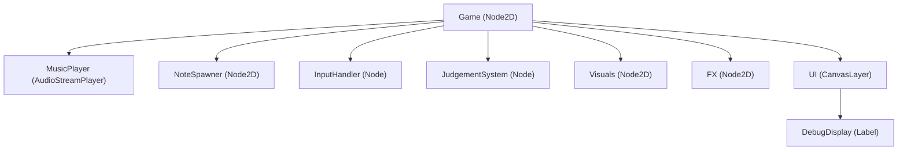
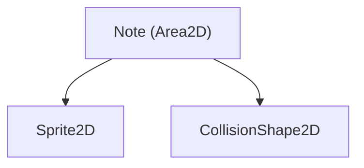
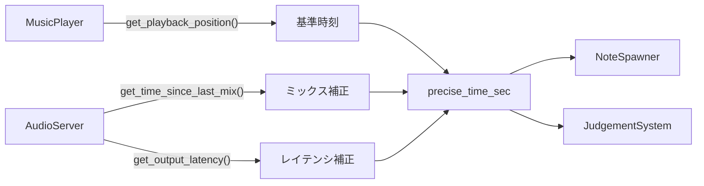
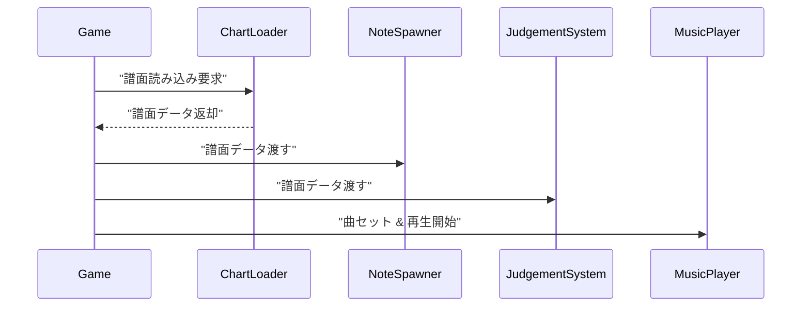
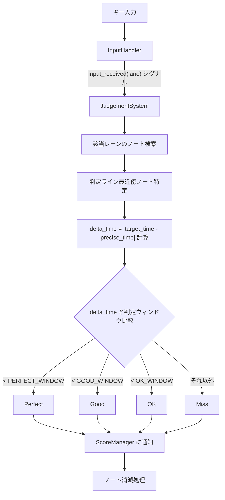
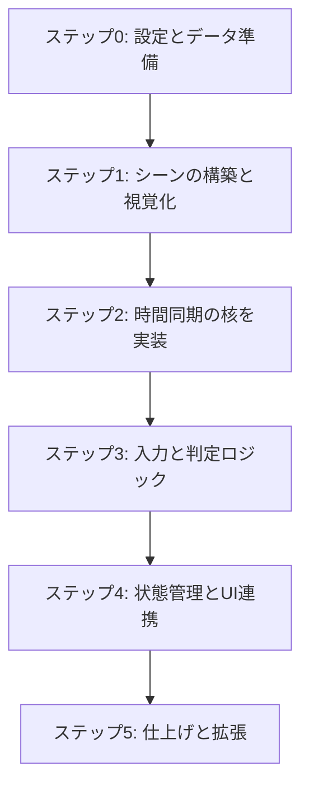

# Godotリズムゲーム：要件定義書

## 概要

Godotエンジンを用いたキーボードリズムゲームのプロトタイプ開発における、堅牢でスケーラブルなアーキテクチャを定義します。

## 基本仕様

- **ゲーム形式**: 上から下へノートが落下する縦スクロール型
- **操作**: 4キー（D, F, J, K）
- **譜面形式**: JSONファイル

## 1. プロジェクト構成と責務の分離

優れたアーキテクチャの基本は、各コンポーネントが単一の責任を持つことです。今回はGodotの**AutoLoad（シングルトン）機能**を積極的に活用し、関心事を明確に分離します。

### AutoLoadコンポーネント

- **`GameConfig.gd` (AutoLoad):** ゲーム全体の設定値を管理します。
  - **責務:** タイミング判定の閾値、ノートの落下速度、キーマッピングなど、調整が必要な定数を一元管理します。これにより、ゲームバランスの調整が容易になります。

- **`ScoreManager.gd` (AutoLoad):** スコア、コンボ、判定結果など、プレイ中の状態を管理します。
  - **責務:** プレイデータの状態保持と、その変更を通知するシグナル（`score_updated`, `combo_changed`など）の発行。UIや他のシステムはこのシグナルを購読します。

- **`ChartLoader.gd` (AutoLoad):** 譜面ファイルの読み込みと解析を担当します。
  - **責務:** JSONファイルを読み込み、Godotが扱いやすいデータ構造（辞書の配列など）に変換して提供します。ゲームロジックからファイルI/O処理を分離します。

## 2. 設定ファイル (`GameConfig.gd`)

プロジェクト設定からこのスクリプトをAutoLoadに登録することで、どこからでも `GameConfig.PERFECT_WINDOW` のようにアクセスできます。

```gdscript
# GameConfig.gd
extends Node

# タイミング判定ウィンドウ（秒）
const PERFECT_WINDOW: float = 0.025
const GOOD_WINDOW: float = 0.05
const OK_WINDOW: float = 0.08

# ノートの落下速度 (pixels per second)
const NOTE_SPEED: float = 600.0

# キーマッピング (Lane Index -> Key Code)
const KEY_MAPPINGS: Dictionary = {
    0: KEY_D,
    1: KEY_F,
    2: KEY_J,
    3: KEY_K
}
```

## 3. 譜面データフォーマット (`song_chart.json`)

将来的な譜面エディタの作成も見据え、汎用的なJSON形式を定義します。

```json
{
    "metadata": {
        "song_title": "Godot Groove",
        "artist": "The GDExtensions",
        "bpm": 130.0,
        "offset_sec": 1.5,
        "song_path": "res://assets/music/godot_groove.ogg"
    },
    "notes": [
        { "beat": 4.0, "lane": 0 },
        { "beat": 4.5, "lane": 1 },
        { "beat": 5.0, "lane": 2 },
        { "beat": 5.5, "lane": 3 }
    ]
}
```

### データ構造の説明

- `metadata`: 曲の基本情報
  - `offset_sec`: 曲の再生開始から最初の1拍目が始まるまでの無音時間（秒）
- `notes`: ノートの配列
  - `beat`: BPM基準の拍数
  - `lane`: 0〜3のレーン番号

## 4. シーンとノードのアーキテクチャ

責務を分離した設計を反映させたシーンツリーを構築します。

### `Game.tscn` (メインゲームシーン)



#### 各ノードの責務

- **Game (Node2D)**: `Game.gd`をアタッチ。ゲーム全体の進行管理と、各コンポーネント間の連携（シグナルの接続など）を行います。
  - **MusicPlayer (AudioStreamPlayer)**: BGMを再生する、**ゲーム内時間のマスタークロック**。
  - **NoteSpawner (Node2D)**: `NoteSpawner.gd`をアタッチ。譜面データに基づき、適切なタイミングでノートを生成する責務を持ちます。
  - **InputHandler (Node)**: `InputHandler.gd`をアタッチ。キーボード入力を検知し、`input_received(lane_index)`のようなシグナルを発行する責務を持ちます。
  - **JudgementSystem (Node)**: `JudgementSystem.gd`をアタッチ。`InputHandler`からのシグナルを受け取り、現在判定ライン付近にあるノートとのタイミングを評価する責務を持ちます。
  - **Visuals (Node2D)**: 背景、レーン、判定ラインなど、静的な視覚要素をまとめるコンテナ。
  - **FX (Node2D)**: ヒットエフェクトや効果音プレイヤーなど、動的な演出要素をまとめるコンテナ。
  - **UI (CanvasLayer)**: スコアやコンボ表示など、UI要素を管理します。`ScoreManager`のシグナルを接続して表示を更新します。
    - **DebugDisplay (Label)**: デバッグ情報を表示するためのラベル。`CanvasLayer`上にあるため、常に最前面に表示されます。

### `Note.tscn` (ノート単体のシーン)



#### ノートの責務とプロパティ

- **Note (Area2D)**: `Note.gd`をアタッチ
  - **責務:** 自身の移動、判定ラインを通過すべき目標時間(`target_time_sec`)の保持
  - **プロパティ:** `lane_index`, `target_time_sec`
  - **Sprite2D**: 見た目
  - **CollisionShape2D**: 当たり判定

## 5. コアシステムのロジック詳細

### 5.1. 同期と時間の管理 (最重要)

ゲームの精度はすべて正確な時間管理にかかっています。



#### マスタークロック

- **基準:** `MusicPlayer.get_playback_position()`
- **高精度な現在時刻の取得:** `Game.gd`内で、毎フレーム以下の計算式で「補正済み現在時刻」を求めます

```gdscript
# Game.gd の _process 内
var precise_time_sec = $MusicPlayer.get_playback_position() + AudioServer.get_time_since_last_mix() - AudioServer.get_output_latency()
```

この`precise_time_sec`がゲーム内における**絶対的な時間**となります。

### 5.2. ゲームの起動シーケンス



1. `Game.gd`の`_ready()`で、`ChartLoader`を呼び出して`song_chart.json`を読み込ませます。
2. 譜面データ（メタデータとノート配列）を`NoteSpawner`と`JudgementSystem`に渡します。
3. `MusicPlayer`に曲をセットし、`offset_sec`を考慮して再生を開始します。

### 5.3. 判定ロジック



#### 処理フロー

1. `InputHandler`がキー入力を検知し、`input_received(lane)`シグナルを発行
2. `JudgementSystem`がシグナルを受信
3. `JudgementSystem`は、そのレーンに現在存在するノートの中から、判定ラインに最も近いものを探します
4. ノートの`target_time_sec`と現在の`precise_time_sec`の差分(`abs(delta_time)`)を計算
5. `delta_time`を`GameConfig`の判定ウィンドウと比較し、"Perfect", "Good", "OK", "Miss"を決定
6. 判定結果を`ScoreManager`に通知し、ノートに消滅するよう伝えます（例：`note.hit()`メソッドを呼び出す）

### 5.4. デバッグ機能

`Game.gd`の`_process`内で`DebugDisplay`ラベルのテキストを更新します。

```gdscript
# Game.gd の _process 内
if Input.is_action_just_pressed("toggle_debug"):
    $UI/DebugDisplay.visible = not $UI/DebugDisplay.visible

if $UI/DebugDisplay.visible:
    var debug_text = "Time: %.3f\n" % precise_time_sec
    debug_text += "FPS: %d\n" % Performance.get_monitor(Performance.TIME_FPS)
    debug_text += "Latency (ms): %.1f" % (AudioServer.get_output_latency() * 1000)
    $UI/DebugDisplay.text = debug_text
```

`"toggle_debug"`は、プロジェクトのインプットマップでF1キーなどに割り当てておきます。

## 6. 開発ロードマップ

このアーキテクチャに基づき、以下の順序で実装を進めることを推奨します。



### ステップ0: 設定とデータ準備

- `GameConfig.gd`を作成し、AutoLoadに登録
- サンプルの`song_chart.json`と音楽ファイル、ノート画像を用意する

### ステップ1: シーンの構築と視覚化

- `Game.tscn`と`Note.tscn`のノードツリーを設計通りに作成
- `NoteSpawner`が単一のノートを生成し、`GameConfig.NOTE_SPEED`に従って落下させる処理を実装

### ステップ2: 時間同期の核を実装

- 音楽を再生し、`precise_time_sec`を計算してデバッグ表示
- `ChartLoader`でJSONを読み込み、`NoteSpawner`が譜面データの`beat`とBPMから`target_time_sec`を計算し、正しいタイミングでノートを生成するようにする

### ステップ3: 入力と判定ロジック

- `InputHandler`がキー入力を受け付けてシグナルを発行する部分を実装
- `JudgementSystem`がシグナルを受け取り、最も単純な「ヒットしたか/してないか」の判定ロジックを実装。コンソールに結果を出力する

### ステップ4: 状態管理とUI連携

- `ScoreManager`を作成し、AutoLoadに登録
- `JudgementSystem`が判定結果を`ScoreManager`に送るようにする
- UIのラベルが`ScoreManager`のシグナルを購読し、スコアやコンボを画面に表示するようにする

### ステップ5: 仕上げと拡張

- ヒット時のエフェクトや効果音を追加
- 判定結果("Perfect"など)を画面に表示するアニメーションを追加
- ノートが入力されずに通り過ぎた場合のMiss判定を実装

## まとめ

この設計に従うことで、各機能が疎結合に保たれ、将来的な機能追加（例：ロングノート、譜面エディタ、新しいゲームモード）が容易になります。
