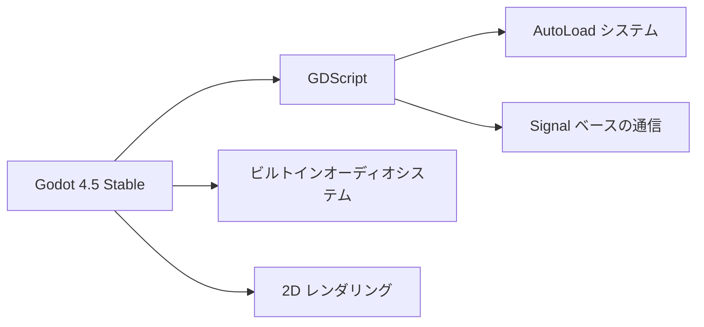
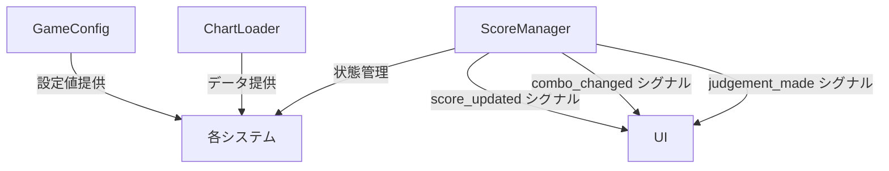
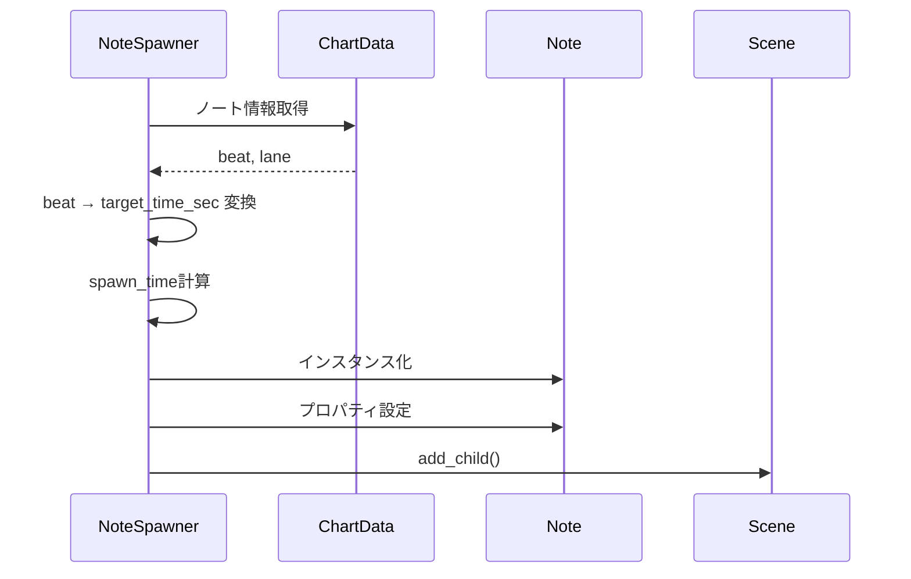
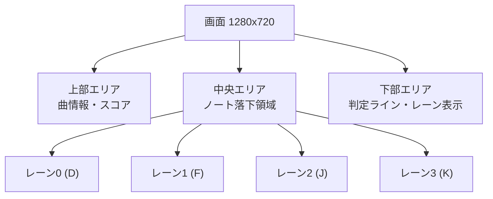
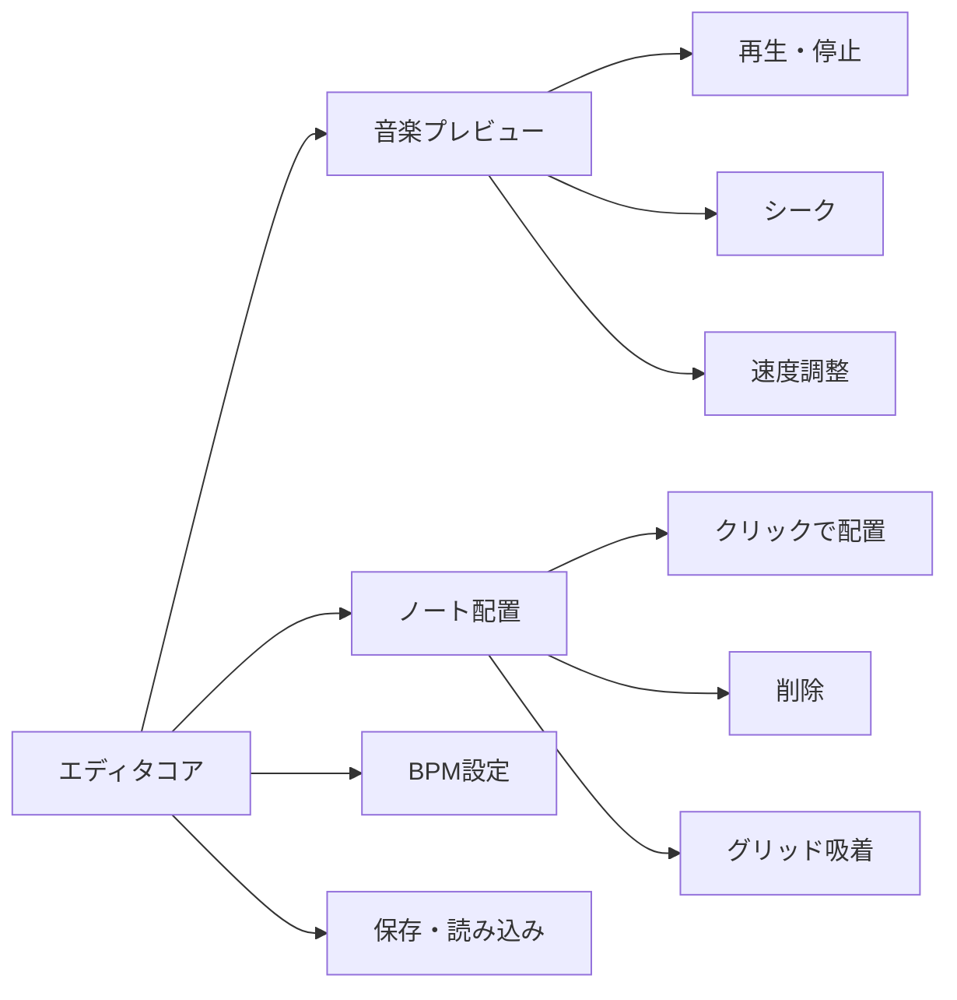

# Godotリズムゲーム：詳細設計書

**バージョン:** 2.0  
**対象Godotバージョン:** 4.5 stable以降  
**スクリプト言語:** GDScript  
**最終更新:** 2025年9月30日

---

## 目次

1. [プロジェクト概要](#1-プロジェクト概要)
2. [技術仕様](#2-技術仕様)
3. [アーキテクチャ設計](#3-アーキテクチャ設計)
4. [データ構造定義](#4-データ構造定義)
5. [コアシステム実装](#5-コアシステム実装)
6. [スコアリングシステム](#6-スコアリングシステム)
7. [UI/UX設計](#7-uiux設計)
8. [譜面エディタ設計](#8-譜面エディタ設計)
9. [実装ロードマップ](#9-実装ロードマップ)
10. [付録：コード例](#10-付録コード例)

---

## 1. プロジェクト概要

### 1.1 基本仕様

- **ゲーム形式**: 上から下へノートが落下する縦スクロール型リズムゲーム
- **操作**: 4キー（D, F, J, K）
- **譜面形式**: JSONファイル
- **音楽形式**: WAV（`.wav`）
- **難易度**: 複数レベル対応（Easy, Normal, Hard, Expert）

### 1.2 開発環境



---

## 2. 技術仕様

### 2.1 プロジェクト設定

#### プロジェクト設定（Project Settings）

```gdscript
# project.godot の推奨設定

[application]
config/name="Rhythm Game"
run/main_scene="res://scenes/Main.tscn"
config/features=PackedStringArray("4.5", "Forward Plus")

[display]
window/size/viewport_width=1280
window/size/viewport_height=720
window/size/mode=2  # Windowed（開発中）
window/size/resizable=true
window/stretch/mode="canvas_items"
window/stretch/aspect="expand"

[audio]
buses/default_bus_layout="res://audio_bus_layout.tres"

[input]
move_right={
    "deadzone": 0.5,
    "events": [Object(InputEventKey,"resource_local_to_scene":false,"resource_name":"","device":0,"window_id":0,"alt_pressed":false,"shift_pressed":false,"ctrl_pressed":false,"meta_pressed":false,"pressed":false,"keycode":0,"physical_keycode":68,"key_label":0,"unicode":0,"location":0,"echo":false,"script":null)]
}
# 以下、F, J, Kキーも同様に設定
```

### 2.2 ディレクトリ構造

```
project/
├── scenes/
│   ├── Main.tscn              # メインゲームシーン
│   ├── Note.tscn              # ノート単体
│   ├── ChartEditor.tscn       # 譜面エディタ
│   └── UI/
│       ├── MainMenu.tscn
│       ├── SongSelect.tscn
│       └── ResultScreen.tscn
├── scripts/
│   ├── autoload/
│   │   ├── GameConfig.gd      # AutoLoad
│   │   ├── ScoreManager.gd    # AutoLoad
│   │   └── ChartLoader.gd     # AutoLoad
│   ├── game/
│   │   ├── Game.gd
│   │   ├── NoteSpawner.gd
│   │   ├── InputHandler.gd
│   │   └── JudgementSystem.gd
│   ├── ui/
│   │   └── UIController.gd
│   └── editor/
│       └── ChartEditor.gd
├── assets/
│   ├── music/
│   │   └── *.wav
│   ├── charts/
│   │   └── *.json
│   ├── textures/
│   │   ├── notes/
│   │   └── ui/
│   └── fonts/
└── addons/
```

---

## 3. アーキテクチャ設計

### 3.1 AutoLoad（シングルトン）設計



#### GameConfig.gd（AutoLoad）

```gdscript
# res://scripts/autoload/GameConfig.gd
extends Node

# ===== タイミング判定ウィンドウ（秒） =====
const PERFECT_WINDOW: float = 0.025  # ±25ms
const GOOD_WINDOW: float = 0.050     # ±50ms
const OK_WINDOW: float = 0.080       # ±80ms
const MISS_WINDOW: float = 0.150     # ±150ms（これ以上は無視）

# ===== スコアリング =====
const SCORE_PERFECT: int = 100
const SCORE_GOOD: int = 70
const SCORE_OK: int = 40
const SCORE_MISS: int = 0

# コンボボーナス（コンボ数に応じた倍率）
const COMBO_MULTIPLIER: Dictionary = {
	10: 1.1,   # 10コンボで1.1倍
	25: 1.2,   # 25コンボで1.2倍
	50: 1.5,   # 50コンボで1.5倍
	100: 2.0   # 100コンボで2.0倍
}

# ===== ノート設定 =====
const NOTE_SPEED: float = 600.0  # pixels per second
const JUDGEMENT_LINE_Y: float = 600.0  # 判定ラインのY座標

# ===== キーマッピング =====
const KEY_MAPPINGS: Dictionary = {
	0: KEY_D,
	1: KEY_F,
	2: KEY_J,
	3: KEY_K
}

# レーン位置（X座標）
const LANE_POSITIONS: Array[float] = [400.0, 520.0, 640.0, 760.0]

# ===== 難易度設定 =====
enum Difficulty {
	EASY,
	NORMAL,
	Hard,
	EXPERT
}

const DIFFICULTY_NAMES: Dictionary = {
	Difficulty.EASY: "Easy",
	Difficulty.NORMAL: "Normal",
	Difficulty.Hard: "Hard",
	Difficulty.EXPERT: "Expert"
}

# ===== デバッグ設定 =====
var debug_mode: bool = false

func _ready() -> void:
	print("[GameConfig] Initialized")

func get_combo_multiplier(combo: int) -> float:
	"""現在のコンボ数に対する倍率を取得"""
	var multiplier := 1.0
	for threshold in COMBO_MULTIPLIER.keys():
		if combo >= threshold:
			multiplier = COMBO_MULTIPLIER[threshold]
	return multiplier

func get_judgement_window(judgement: String) -> float:
	"""判定種別に対応するウィンドウ時間を取得"""
	match judgement:
		"PERFECT": return PERFECT_WINDOW
		"GOOD": return GOOD_WINDOW
		"OK": return OK_WINDOW
		"MISS": return MISS_WINDOW
		_: return 0.0
```

#### ScoreManager.gd（AutoLoad）

```gdscript
# res://scripts/autoload/ScoreManager.gd
extends Node

# ===== シグナル =====
signal score_updated(new_score: int)
signal combo_changed(new_combo: int)
signal judgement_made(judgement: String, delta_time: float)
signal accuracy_updated(accuracy: float)

# ===== 状態変数 =====
var current_score: int = 0
var current_combo: int = 0
var max_combo: int = 0

# 統計
var judgement_counts: Dictionary = {
	"PERFECT": 0,
	"GOOD": 0,
	"OK": 0,
	"MISS": 0
}

var total_notes: int = 0

func _ready() -> void:
	print("[ScoreManager] Initialized")

func reset_game() -> void:
	"""ゲーム開始時にリセット"""
	current_score = 0
	current_combo = 0
	max_combo = 0
	judgement_counts = {
		"PERFECT": 0,
		"GOOD": 0,
		"OK": 0,
		"MISS": 0
	}
	score_updated.emit(0)
	combo_changed.emit(0)

func add_judgement(judgement: String, delta_time: float) -> void:
	"""判定を追加してスコアを計算"""
	judgement_counts[judgement] += 1
	
	if judgement == "MISS":
		current_combo = 0
	else:
		current_combo += 1
		max_combo = max(max_combo, current_combo)
	
	# スコア計算（コンボ倍率適用）
	var base_score := 0
	match judgement:
		"PERFECT": base_score = GameConfig.SCORE_PERFECT
		"GOOD": base_score = GameConfig.SCORE_GOOD
		"OK": base_score = GameConfig.SCORE_OK
		"MISS": base_score = GameConfig.SCORE_MISS
	
	var multiplier := GameConfig.get_combo_multiplier(current_combo)
	var final_score := int(base_score * multiplier)
	current_score += final_score
	
	# シグナル発火
	score_updated.emit(current_score)
	combo_changed.emit(current_combo)
	judgement_made.emit(judgement, delta_time)
	
	# 精度計算
	var total := float(judgement_counts.values().reduce(func(a, b): return a + b, 0))
	if total > 0:
		var accuracy := (judgement_counts["PERFECT"] + judgement_counts["GOOD"] * 0.7 + judgement_counts["OK"] * 0.4) / total * 100.0
		accuracy_updated.emit(accuracy)

func get_accuracy() -> float:
	"""現在の精度（%）を取得"""
	var total := float(judgement_counts.values().reduce(func(a, b): return a + b, 0))
	if total == 0:
		return 0.0
	return (judgement_counts["PERFECT"] + judgement_counts["GOOD"] * 0.7 + judgement_counts["OK"] * 0.4) / total * 100.0

func get_grade() -> String:
	"""精度に基づいてグレードを返す"""
	var acc := get_accuracy()
	if acc >= 95.0:
		return "S"
	elif acc >= 90.0:
		return "A"
	elif acc >= 80.0:
		return "B"
	elif acc >= 70.0:
		return "C"
	else:
		return "D"
```

#### ChartLoader.gd（AutoLoad）

```gdscript
# res://scripts/autoload/ChartLoader.gd
extends Node

# ロード済み譜面のキャッシュ
var chart_cache: Dictionary = {}

func _ready() -> void:
	print("[ChartLoader] Initialized")

func load_chart(file_path: String) -> Dictionary:
	"""譜面JSONファイルを読み込む"""
	# キャッシュチェック
	if chart_cache.has(file_path):
		return chart_cache[file_path]
	
	# ファイル読み込み
	if not FileAccess.file_exists(file_path):
		push_error("[ChartLoader] File not found: " + file_path)
		return {}
	
	var file := FileAccess.open(file_path, FileAccess.READ)
	if file == null:
		push_error("[ChartLoader] Failed to open file: " + file_path)
		return {}
	
	var json_string := file.get_as_text()
	file.close()
	
	# JSON解析
	var json := JSON.new()
	var error := json.parse(json_string)
	if error != OK:
		push_error("[ChartLoader] JSON Parse Error at line %d: %s" % [json.get_error_line(), json.get_error_message()])
		return {}
	
	var data: Dictionary = json.data
	
	# バリデーション
	if not validate_chart(data):
		push_error("[ChartLoader] Invalid chart format: " + file_path)
		return {}
	
	# キャッシュに保存
	chart_cache[file_path] = data
	
	print("[ChartLoader] Loaded chart: " + file_path)
	return data

func validate_chart(data: Dictionary) -> bool:
	"""譜面データの妥当性を検証"""
	if not data.has("metadata") or not data.has("notes"):
		return false
	
	var metadata: Dictionary = data["metadata"]
	var required_keys := ["song_title", "artist", "bpm", "offset_sec", "song_path"]
	for key in required_keys:
		if not metadata.has(key):
			push_error("[ChartLoader] Missing metadata key: " + key)
			return false
	
	# ノートの検証
	var notes: Array = data["notes"]
	for note in notes:
		if not note.has("beat") or not note.has("lane"):
			return false
		if note["lane"] < 0 or note["lane"] > 3:
			return false
	
	return true

func save_chart(file_path: String, chart_data: Dictionary) -> Error:
	"""譜面データをJSONファイルに保存"""
	var file := FileAccess.open(file_path, FileAccess.WRITE)
	if file == null:
		push_error("[ChartLoader] Failed to create file: " + file_path)
		return FileAccess.get_open_error()
	
	var json_string := JSON.stringify(chart_data, "  ", false)
	file.store_string(json_string)
	file.close()
	
	# キャッシュ更新
	chart_cache[file_path] = chart_data
	
	print("[ChartLoader] Saved chart: " + file_path)
	return OK

func get_all_charts() -> Array[String]:
	"""利用可能な全譜面ファイルのパスを取得"""
	var charts: Array[String] = []
	var dir := DirAccess.open("res://assets/charts/")
	if dir:
		dir.list_dir_begin()
		var file_name := dir.get_next()
		while file_name != "":
			if not dir.current_is_dir() and file_name.ends_with(".json"):
				charts.append("res://assets/charts/" + file_name)
			file_name = dir.get_next()
	return charts
```

---

## 4. データ構造定義

### 4.1 譜面データフォーマット（JSON）

```json
{
  "metadata": {
    "song_title": "Godot Groove",
    "artist": "The GDExtensions",
    "bpm": 130.0,
    "offset_sec": 1.5,
    "song_path": "res://assets/music/godot_groove.wav",
    "difficulty": "Normal",
    "chart_author": "Player1",
    "created_date": "2025-09-30"
  },
  "notes": [
    { "beat": 4.0, "lane": 0 },
    { "beat": 4.5, "lane": 1 },
    { "beat": 5.0, "lane": 2 },
    { "beat": 5.5, "lane": 3 },
    { "beat": 6.0, "lane": 0 },
    { "beat": 6.0, "lane": 2 }
  ]
}
```

#### フィールド説明

| フィールド | 型 | 説明 |
|----------|---|------|
| `metadata.song_title` | String | 曲名 |
| `metadata.artist` | String | アーティスト名 |
| `metadata.bpm` | Float | BPM（Beats Per Minute） |
| `metadata.offset_sec` | Float | 曲開始から最初の拍までのオフセット（秒） |
| `metadata.song_path` | String | 音楽ファイルのパス |
| `metadata.difficulty` | String | 難易度名 |
| `notes` | Array | ノートの配列 |
| `notes[].beat` | Float | BPM基準の拍数（小数可） |
| `notes[].lane` | Int | レーン番号（0-3） |

### 4.2 セーブデータフォーマット

```json
{
  "version": "1.0",
  "player_data": {
    "player_name": "Player1",
    "total_play_time": 3600,
    "total_plays": 50
  },
  "scores": [
    {
      "chart_path": "res://assets/charts/song1_normal.json",
      "best_score": 98500,
      "best_accuracy": 97.5,
      "best_combo": 250,
      "grade": "S",
      "play_count": 5,
      "last_played": "2025-09-30T12:00:00"
    }
  ],
  "settings": {
    "master_volume": 0.8,
    "music_volume": 1.0,
    "sfx_volume": 0.7,
    "note_speed": 600.0,
    "visual_offset": 0.0
  }
}
```

---

## 5. コアシステム実装

### 5.1 時間同期システム

Godot 4.xの公式ドキュメントに基づく高精度な時間管理：

```gdscript
# res://scripts/game/Game.gd
extends Node2D

@onready var music_player := $MusicPlayer as AudioStreamPlayer
@onready var note_spawner := $NoteSpawner
@onready var judgement_system := $JudgementSystem

var current_chart: Dictionary = {}
var precise_time_sec: float = 0.0

func _ready() -> void:
	# 譜面読み込み
	current_chart = ChartLoader.load_chart("res://assets/charts/test_song.json")
	if current_chart.is_empty():
		push_error("Failed to load chart")
		return
	
	# 音楽読み込み
	var audio_path: String = current_chart["metadata"]["song_path"]
	var stream := load(audio_path) as AudioStream
	if stream == null:
		push_error("Failed to load audio: " + audio_path)
		return
	
	music_player.stream = stream
	
	# システムに譜面データを渡す
	note_spawner.set_chart_data(current_chart)
	judgement_system.set_chart_data(current_chart)
	
	# スコアリセット
	ScoreManager.reset_game()
	
	# オフセット適用して再生開始
	await get_tree().create_timer(0.5).timeout
	music_player.play()
	
	print("[Game] Started playing: " + current_chart["metadata"]["song_title"])

func _process(delta: float) -> void:
	if not music_player.playing:
		return
	
	# 公式ドキュメント推奨の高精度時間計算
	# https://docs.godotengine.org/en/stable/tutorials/audio/sync_with_audio.html
	precise_time_sec = music_player.get_playback_position() + \
	                   AudioServer.get_time_since_last_mix() - \
	                   AudioServer.get_output_latency()
	
	# 各システムに現在時刻を伝達
	note_spawner.update_time(precise_time_sec)
	judgement_system.update_time(precise_time_sec)
	
	# デバッグ表示更新
	if GameConfig.debug_mode:
		_update_debug_display()

func _update_debug_display() -> void:
	var debug_text := "Time: %.3f\n" % precise_time_sec
	debug_text += "FPS: %d\n" % Performance.get_monitor(Performance.TIME_FPS)
	debug_text += "Latency (ms): %.1f\n" % (AudioServer.get_output_latency() * 1000)
	debug_text += "Active Notes: %d" % note_spawner.get_active_note_count()
	$UI/DebugDisplay.text = debug_text

func _input(event: InputEvent) -> void:
	if event.is_action_pressed("toggle_debug"):
		GameConfig.debug_mode = not GameConfig.debug_mode
		$UI/DebugDisplay.visible = GameConfig.debug_mode
```

### 5.2 ノート生成システム



```gdscript
# res://scripts/game/NoteSpawner.gd
extends Node2D

const NOTE_SCENE := preload("res://scenes/Note.tscn")

var chart_data: Dictionary = {}
var note_queue: Array[Dictionary] = []
var active_notes: Array[Node] = []

var spawn_lead_time: float = 2.0  # ノートを何秒前に生成するか

func set_chart_data(data: Dictionary) -> void:
	"""譜面データを設定"""
	chart_data = data
	_prepare_note_queue()

func _prepare_note_queue() -> void:
	"""ノートキューを準備（beatからtarget_time_secに変換）"""
	note_queue.clear()
	
	var bpm: float = chart_data["metadata"]["bpm"]
	var offset: float = chart_data["metadata"]["offset_sec"]
	var notes: Array = chart_data["notes"]
	
	for note_data in notes:
		var beat: float = note_data["beat"]
		var lane: int = note_data["lane"]
		
		# beat → 秒に変換
		var target_time := offset + (beat / bpm) * 60.0
		
		note_queue.append({
			"target_time": target_time,
			"lane": lane,
			"spawned": false
		})
	
	# 時間順にソート
	note_queue.sort_custom(func(a, b): return a["target_time"] < b["target_time"])
	
	print("[NoteSpawner] Prepared %d notes" % note_queue.size())

func update_time(current_time: float) -> void:
	"""現在時刻を受け取ってノートを生成"""
	for note_info in note_queue:
		if note_info["spawned"]:
			continue
		
		var spawn_time := note_info["target_time"] - spawn_lead_time
		if current_time >= spawn_time:
			_spawn_note(note_info)
			note_info["spawned"] = true

func _spawn_note(note_info: Dictionary) -> void:
	"""ノートを実際に生成"""
	var note := NOTE_SCENE.instantiate()
	note.lane_index = note_info["lane"]
	note.target_time_sec = note_info["target_time"]
	
	# 初期位置設定（画面外上部）
	var lane_x := GameConfig.LANE_POSITIONS[note_info["lane"]]
	note.position = Vector2(lane_x, -50)
	
	add_child(note)
	active_notes.append(note)
	
	# ノートが削除されたら配列から除外
	note.tree_exited.connect(func(): active_notes.erase(note))

func get_active_note_count() -> int:
	return active_notes.size()

func get_notes_in_lane(lane: int) -> Array[Node]:
	"""指定レーンのアクティブなノートを取得"""
	var lane_notes: Array[Node] = []
	for note in active_notes:
		if note.lane_index == lane:
			lane_notes.append(note)
	return lane_notes
```

### 5.3 入力処理システム

```gdscript
# res://scripts/game/InputHandler.gd
extends Node

signal input_received(lane_index: int)

func _ready() -> void:
	print("[InputHandler] Initialized")

func _input(event: InputEvent) -> void:
	if not event is InputEventKey:
		return
	
	if not event.pressed or event.echo:
		return
	
	# キーマッピングをチェック
	for lane in GameConfig.KEY_MAPPINGS.keys():
		if event.physical_keycode == GameConfig.KEY_MAPPINGS[lane]:
			input_received.emit(lane)
			break
```

### 5.4 判定システム

```gdscript
# res://scripts/game/JudgementSystem.gd
extends Node

@onready var input_handler := $"../InputHandler" as Node

var current_time: float = 0.0
var note_spawner: Node = null

func _ready() -> void:
	note_spawner = get_node("../NoteSpawner")
	input_handler.input_received.connect(_on_input_received)
	print("[JudgementSystem] Initialized")

func update_time(time: float) -> void:
	current_time = time

func _on_input_received(lane_index: int) -> void:
	"""入力を受けて判定を行う"""
	var notes_in_lane := note_spawner.get_notes_in_lane(lane_index)
	
	if notes_in_lane.is_empty():
		# レーンにノートがない = Miss判定なし（ペナルティなし）
		return
	
	# 判定ラインに最も近いノートを探す
	var closest_note: Node = null
	var min_distance := INF
	
	for note in notes_in_lane:
		var distance := abs(note.target_time_sec - current_time)
		if distance < min_distance:
			min_distance = distance
			closest_note = note
	
	if closest_note == null:
		return
	
	var delta_time := closest_note.target_time_sec - current_time
	var abs_delta := abs(delta_time)
	
	# 判定
	var judgement := ""
	if abs_delta <= GameConfig.PERFECT_WINDOW:
		judgement = "PERFECT"
	elif abs_delta <= GameConfig.GOOD_WINDOW:
		judgement = "GOOD"
	elif abs_delta <= GameConfig.OK_WINDOW:
		judgement = "OK"
	else:
		# ウィンドウ外 = 無視
		return
	
	# スコアマネージャーに通知
	ScoreManager.add_judgement(judgement, delta_time)
	
	# ノートを消滅させる
	closest_note.hit(judgement)
	
	print("[Judgement] %s (Δ%.3fms)" % [judgement, delta_time * 1000])
```

---

## 6. スコアリングシステム

### 6.1 スコア計算式

```
最終スコア = Σ(基本スコア × コンボ倍率)

基本スコア:
- PERFECT: 100点
- GOOD: 70点
- OK: 40点
- MISS: 0点

コンボ倍率:
- 0-9コンボ: 1.0倍
- 10-24コンボ: 1.1倍
- 25-49コンボ: 1.2倍
- 50-99コンボ: 1.5倍
- 100コンボ以上: 2.0倍
```

### 6.2 精度（Accuracy）計算

```
精度(%) = (PERFECT数 + GOOD数×0.7 + OK数×0.4) / 総ノート数 × 100
```

### 6.3 グレード判定

| 精度 | グレード |
|-----|---------|
| 95%以上 | S |
| 90-94% | A |
| 80-89% | B |
| 70-79% | C |
| 70%未満 | D |

---

## 7. UI/UX設計

### 7.1 ゲーム画面レイアウト



### 7.2 UI実装例

```gdscript
# res://scripts/ui/UIController.gd
extends CanvasLayer

@onready var score_label := $ScoreLabel as Label
@onready var combo_label := $ComboLabel as Label
@onready var accuracy_label := $AccuracyLabel as Label
@onready var judgement_label := $JudgementLabel as Label

func _ready() -> void:
	# ScoreManagerのシグナルに接続
	ScoreManager.score_updated.connect(_on_score_updated)
	ScoreManager.combo_changed.connect(_on_combo_changed)
	ScoreManager.accuracy_updated.connect(_on_accuracy_updated)
	ScoreManager.judgement_made.connect(_on_judgement_made)

func _on_score_updated(new_score: int) -> void:
	score_label.text = "Score: %d" % new_score

func _on_combo_changed(new_combo: int) -> void:
	if new_combo > 0:
		combo_label.text = "%d COMBO" % new_combo
		combo_label.visible = true
	else:
		combo_label.visible = false

func _on_accuracy_updated(accuracy: float) -> void:
	accuracy_label.text = "Accuracy: %.1f%%" % accuracy

func _on_judgement_made(judgement: String, delta_time: float) -> void:
	# 判定表示アニメーション
	judgement_label.text = judgement
	judgement_label.modulate = _get_judgement_color(judgement)
	judgement_label.visible = true
	
	# フェードアウトアニメーション
	var tween := create_tween()
	tween.tween_property(judgement_label, "modulate:a", 0.0, 0.5)
	tween.tween_callback(func(): judgement_label.visible = false)

func _get_judgement_color(judgement: String) -> Color:
	match judgement:
		"PERFECT": return Color.GOLD
		"GOOD": return Color.LIME_GREEN
		"OK": return Color.ORANGE
		"MISS": return Color.RED
		_: return Color.WHITE
```

---

## 8. 譜面エディタ設計

### 8.1 エディタ機能要件



### 8.2 エディタUI設計

```
┌─────────────────────────────────────────────┐
│ ファイル  編集  表示  ツール  ヘルプ          │
├─────────────────────────────────────────────┤
│ ♪ 再生 ▮ 停止  速度: [1.0x]  BPM: [130]   │
├──────────┬──────────────────────────────────┤
│          │                                  │
│ メタ     │         ノート配置エリア          │
│ データ   │      (タイムライン表示)          │
│          │                                  │
│ 曲名     │  [Beat 0] ────────────────────  │
│ アーティ │  [Beat 1] ────────────────────  │
│ スト     │  [Beat 2] ──●─────────────────  │
│ BPM      │  [Beat 3] ────────●───────────  │
│ オフセッ │  [Beat 4] ●──────────●────────  │
│ ト       │    ...                           │
│          │   D    F    J    K  (レーン)    │
│ [保存]   │                                  │
│ [読込]   │                                  │
└──────────┴──────────────────────────────────┘
```

### 8.3 エディタ実装例

```gdscript
# res://scripts/editor/ChartEditor.gd
extends Control

@onready var music_player := $MusicPlayer as AudioStreamPlayer
@onready var timeline := $Timeline as Control

var current_chart: Dictionary = {
	"metadata": {
		"song_title": "",
		"artist": "",
		"bpm": 120.0,
		"offset_sec": 0.0,
		"song_path": "",
		"difficulty": "Normal",
		"chart_author": "",
		"created_date": ""
	},
	"notes": []
}

var current_file_path: String = ""
var grid_snap_enabled: bool = true
var snap_division: float = 0.25  # 1/4拍単位

func _ready() -> void:
	_setup_ui()

func _setup_ui() -> void:
	# UIコントロールの初期化
	$TopBar/PlayButton.pressed.connect(_on_play_pressed)
	$TopBar/StopButton.pressed.connect(_on_stop_pressed)
	$TopBar/SaveButton.pressed.connect(_on_save_pressed)
	$TopBar/LoadButton.pressed.connect(_on_load_pressed)
	
	timeline.note_placed.connect(_on_note_placed)
	timeline.note_removed.connect(_on_note_removed)

func _on_play_pressed() -> void:
	if music_player.stream:
		music_player.play()

func _on_stop_pressed() -> void:
	music_player.stop()

func _on_note_placed(beat: float, lane: int) -> void:
	"""ノート配置"""
	if grid_snap_enabled:
		beat = snappedf(beat, snap_division)
	
	current_chart["notes"].append({
		"beat": beat,
		"lane": lane
	})
	
	print("[Editor] Note placed: beat=%.2f, lane=%d" % [beat, lane])

func _on_note_removed(beat: float, lane: int) -> void:
	"""ノート削除"""
	for i in range(current_chart["notes"].size() - 1, -1, -1):
		var note = current_chart["notes"][i]
		if is_equal_approx(note["beat"], beat) and note["lane"] == lane:
			current_chart["notes"].remove_at(i)
			print("[Editor] Note removed: beat=%.2f, lane=%d" % [beat, lane])
			break

func _on_save_pressed() -> void:
	"""譜面を保存"""
	if current_file_path.is_empty():
		# ファイルダイアログを表示
		$FileDialog.file_mode = FileDialog.FILE_MODE_SAVE_FILE
		$FileDialog.filters = ["*.json ; JSON Files"]
		$FileDialog.popup_centered()
		await $FileDialog.file_selected
		current_file_path = $FileDialog.current_path
	
	# 現在日時を設定
	current_chart["metadata"]["created_date"] = Time.get_datetime_string_from_system()
	
	var error := ChartLoader.save_chart(current_file_path, current_chart)
	if error == OK:
		print("[Editor] Chart saved successfully")
	else:
		push_error("[Editor] Failed to save chart")

func _on_load_pressed() -> void:
	"""譜面を読み込み"""
	$FileDialog.file_mode = FileDialog.FILE_MODE_OPEN_FILE
	$FileDialog.filters = ["*.json ; JSON Files"]
	$FileDialog.popup_centered()
	await $FileDialog.file_selected
	
	var file_path: String = $FileDialog.current_path
	current_chart = ChartLoader.load_chart(file_path)
	if not current_chart.is_empty():
		current_file_path = file_path
		_update_editor_display()
		print("[Editor] Chart loaded successfully")

func _update_editor_display() -> void:
	"""エディタ表示を更新"""
	timeline.set_chart_data(current_chart)
	$MetadataPanel/SongTitleEdit.text = current_chart["metadata"]["song_title"]
	$MetadataPanel/ArtistEdit.text = current_chart["metadata"]["artist"]
	$MetadataPanel/BPMSpinBox.value = current_chart["metadata"]["bpm"]
```

---

## 9. 実装ロードマップ

### Phase 0: プロジェクトセットアップ（1-2日）

- [x] Godot 4.5プロジェクト作成
- [ ] ディレクトリ構造構築
- [ ] AutoLoadスクリプト作成
  - [ ] GameConfig.gd
  - [ ] ScoreManager.gd
  - [ ] ChartLoader.gd
- [ ] Input Map設定（D, F, J, K）
- [ ] テスト用WAVファイル準備

### Phase 1: コアゲームプレイ（3-5日）

- [ ] シーン構築
  - [ ] Game.tscn
  - [ ] Note.tscn
- [ ] 時間同期システム実装
- [ ] NoteSpawner実装
- [ ] Note移動ロジック実装
- [ ] InputHandler実装
- [ ] JudgementSystem実装
- [ ] 基本的なスコアリング実装

### Phase 2: UI実装（2-3日）

- [ ] UIController実装
- [ ] スコア表示
- [ ] コンボ表示
- [ ] 判定表示アニメーション
- [ ] 精度・グレード表示
- [ ] デバッグ表示

### Phase 3: 譜面エディタ（3-5日）

- [ ] ChartEditor.tscn構築
- [ ] タイムライン表示
- [ ] ノート配置機能
- [ ] ノート削除機能
- [ ] グリッドスナップ機能
- [ ] 音楽プレビュー機能
- [ ] メタデータ編集UI
- [ ] 保存・読み込み機能

### Phase 4: テストと調整（2-3日）

- [ ] テスト譜面作成（Easy, Normal, Hard）
- [ ] タイミング調整
- [ ] スコアバランス調整
- [ ] バグ修正
- [ ] パフォーマンス最適化

### Phase 5: 拡張機能（オプション）

- [ ] メインメニュー
- [ ] 曲選択画面
- [ ] リザルト画面
- [ ] ハイスコア保存
- [ ] 設定画面
- [ ] エフェクト・パーティクル
- [ ] BGMフェードイン/アウト

---

## 10. 付録：コード例

### 10.1 Note.gd（ノートスクリプト）

```gdscript
# res://scripts/game/Note.gd
extends Area2D

var lane_index: int = 0
var target_time_sec: float = 0.0
var is_hit: bool = false

@onready var sprite := $Sprite2D
@onready var animation_player := $AnimationPlayer

func _ready() -> void:
	# レーンに応じて色を変更
	var colors := [Color.RED, Color.BLUE, Color.GREEN, Color.YELLOW]
	sprite.modulate = colors[lane_index]

func _process(delta: float) -> void:
	if is_hit:
		return
	
	# 下方向に移動
	position.y += GameConfig.NOTE_SPEED * delta
	
	# 画面外に出たら削除（Miss判定）
	if position.y > GameConfig.JUDGEMENT_LINE_Y + 100:
		_miss()

func hit(judgement: String) -> void:
	"""ヒット時の処理"""
	if is_hit:
		return
	
	is_hit = true
	
	# ヒットエフェクト
	animation_player.play("hit_" + judgement.to_lower())
	
	# 少し遅延して削除
	await animation_player.animation_finished
	queue_free()

func _miss() -> void:
	"""Miss判定"""
	if is_hit:
		return
	
	ScoreManager.add_judgement("MISS", 0.0)
	queue_free()
```

### 10.2 テスト用譜面データ

```json
{
  "metadata": {
    "song_title": "Test Song - Basic Pattern",
    "artist": "Test Artist",
    "bpm": 120.0,
    "offset_sec": 2.0,
    "song_path": "res://assets/music/test_song.wav",
    "difficulty": "Normal",
    "chart_author": "System",
    "created_date": "2025-09-30"
  },
  "notes": [
    { "beat": 0.0, "lane": 0 },
    { "beat": 0.5, "lane": 1 },
    { "beat": 1.0, "lane": 2 },
    { "beat": 1.5, "lane": 3 },
    { "beat": 2.0, "lane": 0 },
    { "beat": 2.0, "lane": 2 },
    { "beat": 2.5, "lane": 1 },
    { "beat": 2.5, "lane": 3 },
    { "beat": 3.0, "lane": 0 },
    { "beat": 3.0, "lane": 1 },
    { "beat": 3.0, "lane": 2 },
    { "beat": 3.0, "lane": 3 },
    { "beat": 4.0, "lane": 0 },
    { "beat": 4.25, "lane": 1 },
    { "beat": 4.5, "lane": 2 },
    { "beat": 4.75, "lane": 3 },
    { "beat": 5.0, "lane": 3 },
    { "beat": 5.25, "lane": 2 },
    { "beat": 5.5, "lane": 1 },
    { "beat": 5.75, "lane": 0 }
  ]
}
```

### 10.3 Input Map設定（project.godot）

```ini
[input]

lane_0={
"deadzone": 0.5,
"events": [Object(InputEventKey,"resource_local_to_scene":false,"resource_name":"","device":0,"window_id":0,"alt_pressed":false,"shift_pressed":false,"ctrl_pressed":false,"meta_pressed":false,"pressed":false,"keycode":0,"physical_keycode":68,"key_label":0,"unicode":0,"location":0,"echo":false,"script":null)]
}

lane_1={
"deadzone": 0.5,
"events": [Object(InputEventKey,"resource_local_to_scene":false,"resource_name":"","device":0,"window_id":0,"alt_pressed":false,"shift_pressed":false,"ctrl_pressed":false,"meta_pressed":false,"pressed":false,"keycode":0,"physical_keycode":70,"key_label":0,"unicode":0,"location":0,"echo":false,"script":null)]
}

lane_2={
"deadzone": 0.5,
"events": [Object(InputEventKey,"resource_local_to_scene":false,"resource_name":"","device":0,"window_id":0,"alt_pressed":false,"shift_pressed":false,"ctrl_pressed":false,"meta_pressed":false,"pressed":false,"keycode":0,"physical_keycode":74,"key_label":0,"unicode":0,"location":0,"echo":false,"script":null)]
}

lane_3={
"deadzone": 0.5,
"events": [Object(InputEventKey,"resource_local_to_scene":false,"resource_name":"","device":0,"window_id":0,"alt_pressed":false,"shift_pressed":false,"ctrl_pressed":false,"meta_pressed":false,"pressed":false,"keycode":0,"physical_keycode":75,"key_label":0,"unicode":0,"location":0,"echo":false,"script":null)]
}

toggle_debug={
"deadzone": 0.5,
"events": [Object(InputEventKey,"resource_local_to_scene":false,"resource_name":"","device":0,"window_id":0,"alt_pressed":false,"shift_pressed":false,"ctrl_pressed":false,"meta_pressed":false,"pressed":false,"keycode":0,"physical_keycode":4194332,"key_label":0,"unicode":0,"location":0,"echo":false,"script":null)]
}
```

---

## まとめ

この設計書は、Godot 4.5公式ドキュメントに基づいた実装可能な仕様を提供します。特に以下の点に注意して実装を進めてください：

1. **時間同期の精度**: `AudioServer.get_time_since_last_mix()`と`get_output_latency()`を使用した高精度な時間管理
2. **シグナルベースの通信**: Godotのシグナルシステムを活用した疎結合なアーキテクチャ
3. **AutoLoadの活用**: ゲーム全体で共有する設定やマネージャーをシングルトンとして管理
4. **譜面エディタ**: テストと開発効率のため、早期に実装することを推奨

各Phase完了後にテストプレイを行い、タイミングやゲームバランスを調整しながら開発を進めることをお勧めします。
